# AgentLoop 数据飞轮实践系列（共 5 篇 · 已完结）

> 来源：阿里云智能体观测与优化平台 AgentLoop（微信公众号 series，agentloop.console.aliyun.com）
> 抓取整理：2026-09-03（Part 1-4）；2026-09-03 补齐 Part 5（经验库与消融实验）。**系列 5 篇全部整理归档。**
> 原文严格忠实（含所有图片里的内容转写）；图片已下载到本地，按篇分子目录。

***

# AgentLoop 数据飞轮实践（一）：总览 —— 让 Agent 持续调优的闭环

本文是 AgentLoop 数据飞轮实践系列 · 第 1 篇（共 5 篇），下一篇：数据接入 —— 四种方式把 Agent 连进 AgentLoop。

Agent 上线只是起点。真正决定 Agent 好不好用的，是上线之后能不能持续调优：用户反馈的问题能不能被系统性地发现、沉淀、验证、修复，并且让 Agent 一次比一次聪明。这件事之所以难，是因为它天然是一个循环：不跑起来就没有真实数据，没有数据就不知道该优化什么，优化了又必须有办法证明真的变好了。很多团队的调优停留在"看几条用户吐槽、手动改改 Prompt"的阶段——零散、不可复现，也无法回答"这次改动到底是变好还是变坏"。这正是 AgentLoop 要解决的核心问题。

本文基于一次完整的实操演示（从创建工作空间到消融实验验证收益），带你总览 AgentLoop 的数据飞轮是怎么转起来的。后续四篇会把演示里的每一步拆开细讲，建议先读完本篇建立全景，再进入细节。

## 01 从一个客服 Agent 开始

演示从创建一个工作空间开始。我们创建一个客服场景的 Agent —— Customer Support，并选择自动创建工作空间：

**图 1 转写**（创建工作空间表单截图：空间区域选华东 1（杭州）；智能体空间（AgentSpace）名称支持 3-42 字符、小写字母/数字/连字符，全局唯一创建后不可修改；选择「云雀 2.0 工作空间」；「Agent 轨迹」说明开启后将 Trace 加工为 ATTF 标准的 Agent 轨迹，提升智能体迭代效果；下方按钮为「选择已有」与「自动创建」）

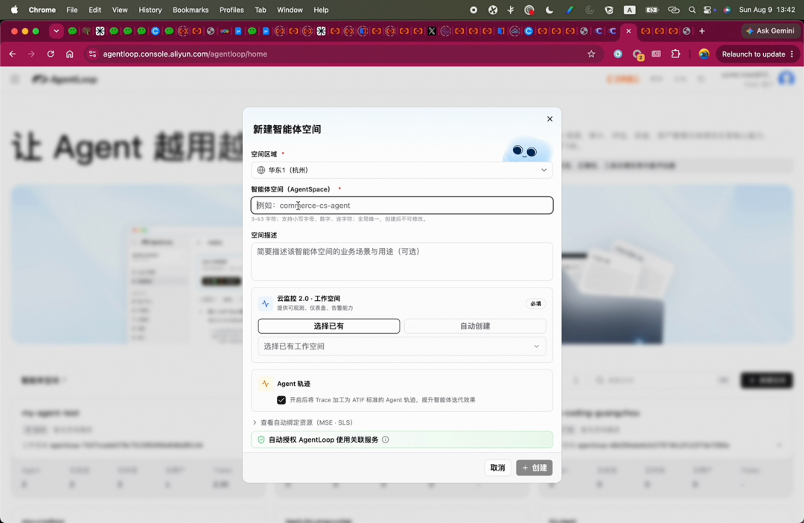

图 1：创建客服 Agent 工作空间

工作空间（AgentSpace）是后续一切资源的边界：数据、数据集、评估器、实验都归属在某个空间之下。选择"自动创建"之后，平台会把客服场景常用的基础资源一并准备好，省去从零搭建的麻烦。

这个客服 Agent 基于 Claude Code / Claude Agent SDK 构建——它是 AgentLoop 自身的一个客服 Agent。选它做演示有一个好处：这类 Agent 的接入方式很有代表性（探针或 webhook 两条路），第 2 篇会借它完整走一遍接入流程。后续的评估、实验、经验注入，也都围绕这个 Agent 展开。

## 02 AgentLoop 的核心定位：持续调优

用一句话概括 AgentLoop 的核心事情：帮助用户调优 Agent，覆盖从 Agent 开发到上线之后的持续调优全过程。注意"全过程"三个字。开发期的调优靠测试集和直觉还能应付，上线之后的调优面对的是真实、发散、持续涌入的用户请求——这时需要的不是几次手工调优，而是一套能自动发现问题、沉淀资产、验证效果的机制。AgentLoop 提供的就是这样一组端到端的原始能力，并把它们串成一个数据飞轮：

**图 2 转写**（AgentLoop 控制台界面截图：左侧导航为「Agent 总览 / 快速启动 / 观测与审计（AI Agent 可观测、仪表盘、审计）/ 接入中心 / 评估与实验（数据中心、评估、实验）/ 持续优化 / Agent 资产 / 上下文工程 / 系统管理」；主页为「评估」子页，包含评估任务、分析洞察、评估器；任务列表当前为「暂无评估任务」）

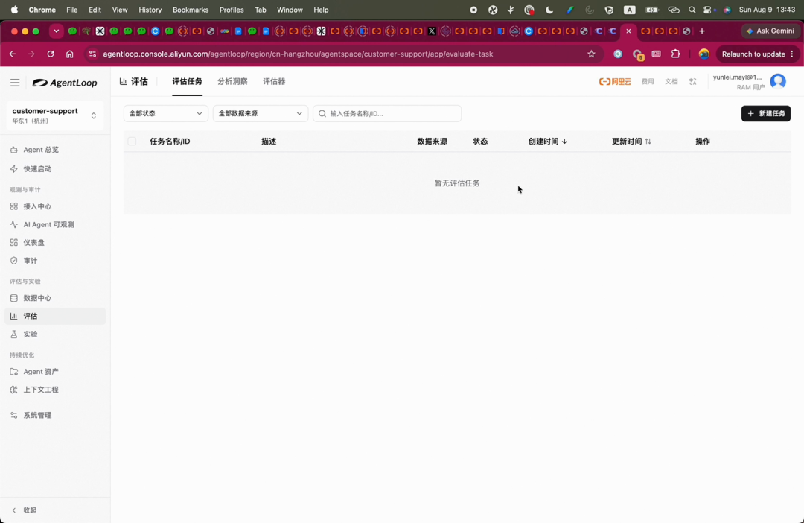

图 2：接入、观测、审计、数据集、评估、实验等功能入口

飞轮的转动路径是：

1. **数据接入**：把 Agent 的 trace 数据接入上来（在接入中心完成）。这是一切的地基——没有数据，后面所有环节都是空转；
2. **观测**：对 trace 数据做观测，看清 Agent 的每一次运行：调了哪些模型、用了哪些工具、走了什么路径；
3. **审计**：对运行数据做安全审计，覆盖合规视角的检查；
4. **数据集**：观测中发现的 badcase（回答糟糕、流程跑偏的个案），保存沉淀到数据集。数据集是飞轮的"弹药库"，后面实验回测用的就是它；
5. **评估**：创建评估任务，从结果和过程两个角度评估 Agent 的响应质量——不只看最终答案对不对，也看执行过程合不合理；
6. **实验**：评估之后挑出 badcase 存进数据集，通过实验一轮一轮回测，建立实验计划。每回测一轮观测一次整体分数，分数低就继续针对性调优；
7. **经验库**：后台算法自动化地从运行轨迹中挖掘经验，反哺 Agent——这是飞轮里唯一不需要人类专家介入的环节。

每转一圈，Agent 的运行数据变成评估样本，评估结论变成优化动作，优化效果又被下一轮评估验证——这就是"数据飞轮"的含义。飞轮的关键不在于某一个环节多强，而在于环节之间首尾相接：评估的产出是实验的输入，实验的结论又指回下一轮评估，经验库则让每一圈都比上一圈起点更高。

**图 3 转写**（数据飞轮全景图：数据接入（OTel 探针 · trace 上报）→ 观测（看清每一次运行）→ 审计（运行安全审计）→ 数据集（badcase 沉淀）→ 评估（结果 + 过程双维度）→ 实验（回测验证优化）→ 经验库（自动挖掘经验资产）→ Agent 运行（持续调优 · 越转越好）；各环节间标注：运行数据上报、badcase 入库、评估任务、回测迭代、经验召回/上下文注入；底部说明：飞轮每转一圈：运行数据 → 评估样本 → 优化动作 → 经验资产，Agent 一次比一次更好）

图 3：数据飞轮全景：接入 → 观测 → 审计 → 数据集 → 评估 → 实验 → 经验库，经验再反哺 Agent

## 03 两种调优模式

围绕这套能力，AgentLoop 把调优过程分成两种模式，对应不同阶段的诉求。可以理解为：模式一是"人开车"，模式二是"自动驾驶"，而演示会把两条路都走一遍。

**▍模式一：人类专家驱动**

有些调优需要人类专家输入——特别是特定行业、领域的知识。什么样的回答算"好"，在金融、医疗、客服等不同场景里标准完全不同，这些判断标准没法凭空自动化，必须由懂业务的人给出来。这种模式下：

- 人类专家提供评判标准（什么样的回答是好的），驱动整个调优流程的建立；
- 数据接入后，通过在线评估把 badcase 抓出来；
- badcase 保存进数据集；
- 通过实验一轮一轮回测，每轮观测整体分数；
- 发现哪个分数低，就继续针对性调优，循环迭代。

这是一条"专家知识 → 评估标准 → 数据沉淀 → 回测验证"的手工闭环，适合业务上线初期建立质量标准。它的价值不只是抓出几个 badcase，更重要的是把专家头脑里"这个回答不行"的隐性判断，固化成可复用、可回测的显性标准（Rubric）——这份标准本身就是团队的资产。

**▍模式二：全自动化（经验库）**

另一种是端到端的全自动模式，不需要人类专家介入：

- 把通用 Agent 常见的优化手段沉淀成经验库；
- 数据接入后开启经验库，平台自动从 Agent 的历史运行轨迹中挖掘经验；
- 在 Agent 里安装一个 Skill，就能自动把经验召回出来；
- 经验本质上是 Agent 运行历史轨迹中沉淀下来的经验资产，类似沉淀出来的 Skill 信息。

通用优化手段包括：工具调用的执行情况、延时、执行准确率、执行路径等通用场景。这些维度不依赖具体业务，任何 Agent 都会遇到，因此适合自动化挖掘。但面对真实业务场景时，往往还有自定义的业务需求，所以经验注入的效果需要用实验严格验证——经验到底帮没帮上忙、怎么注入收益最大，要用数字说话，这就是本系列最后一篇消融实验要讲的内容。

两种模式不是二选一，而是互补：模式一建立标准、兜住业务底线，模式二在标准之上持续自动增益。演示的顺序也正是这样——先走手工闭环，再开全自动化。

**图 4 转写**（两种调优模式对比图：模式一「人类专家驱动（手工闭环）」：循环迭代——专家知识提供评判标准 → 在线评估抓出 badcase → 数据集 badcase 沉淀 → 实验回测每轮观测分数 → 针对性调优低分项迭代；模式二「全自动化（经验库）」：经验库沉淀通用优化手段 → 自动挖掘历史运行轨迹 → Skill 召回装一个 Skill 即用 → 上下文注入，Agent 越跑越好 → 消融实验验证：耗时 ↓30%\~40%，成本 ↓20%\~47%；底部说明：模式一适合业务初期建立质量标准；模式二由平台全自动完成，收益经消融实验严格验证）

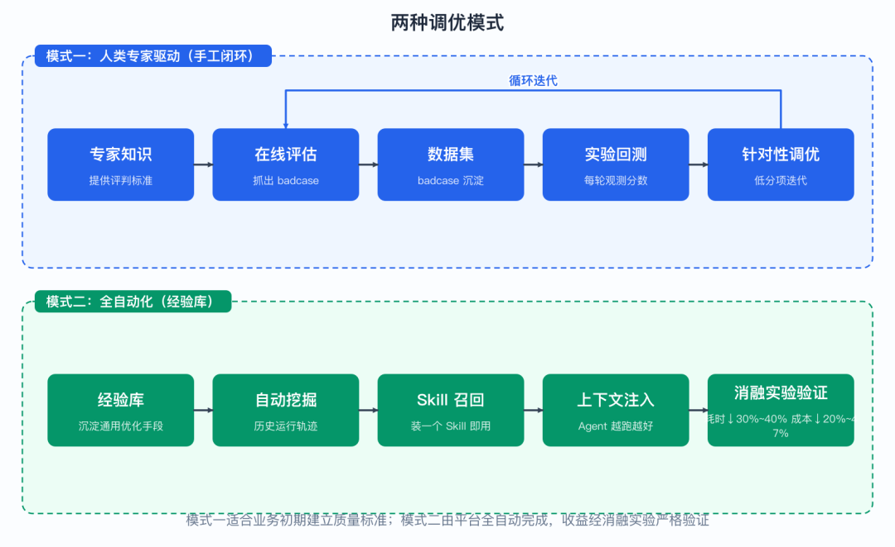

图 4：两种调优模式：人类专家驱动的手工闭环 vs 经验库全自动化

## 04 本系列的路线图

这次实操演示的顺序，恰好是数据飞轮转一圈的顺序。本系列将按以下路线展开：

**路线图转写**（表格：第 1 篇（本文）总览——核心定位、数据飞轮、两种调优模式；第 2 篇 数据接入——OTel 探针四种接入方式；Claude Code + LoongSuite Pilot 实操；第 3 篇 评估——黄金指标 → Rubric → 评估器 → 评估任务 → badcase 闭环；第 4 篇 实验——实验计划、离线实验平台、题目级 Rubric、实验大盘；第 5 篇 经验库——经验自动挖掘、Skill 召回、消融实验与最终收益）

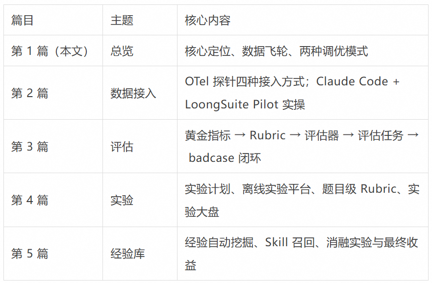

演示将先完整走一遍"人类专家驱动"的手工调优链路（数据接入 → 评估 → 实验），再演示全自动化的经验库，最后用消融实验证明经验注入的真实收益：耗时降低 30%\~40%，成本降低 20%\~47%。

读这个系列你能拿到三样东西：一是可直接照做的操作路径（每一步演示里都有真实画面）；二是每个环节背后的设计逻辑（为什么要有采样、为什么要题目级 Rubric、为什么经验要做护栏）；三是一套验证方法论（怎么用实验和消融证明优化真实有效）。

如果你正在负责一个已上线 Agent 的质量，这套流程基本可以原样搬过去。

## 下一篇预告

数据接入是整个飞轮的起点。AgentLoop 基于 OTel 标准协议和探针技术提供了四种接入方式，我们将亲手把 Claude Code 构建的客服 Agent 接入平台——详见第 2 篇。

***

# 数据飞轮的起点：四种方式把 Agent 连进 AgentLoop丨AgentLoop 数据飞轮实践（二）

AgentLoop 数据飞轮实践系列 · 第 2 篇 / 共 5 篇：上一篇：总览 —— 让 Agent 持续调优的闭环 / 下一篇：评估 —— 从黄金指标到 Rubric

数据接入是数据飞轮的起点：没有高质量的运行数据，观测、评估、实验都无从谈起。但"把数据接上来"这件事本身并不简单——Agent 不像传统微服务只有一种调用形态，它可能是开箱即用的通用 Agent，可能是基于框架研发的，可能是高代码自研的，甚至可能完全不想改一行代码。这一篇讲清楚两件事：智能体观测与优化平台 AgentLoop 的数据接入能力是怎么设计的（为什么四种形态的 Agent 都能接），以及如何亲手把一个基于 Claude Code 的 Agent 接入平台。

## 01 技术底座：OTel 协议+探针

AgentLoop 的数据接入构建在 OTel（OpenTelemetry）标准协议之上，以探针的形式工作：

**图 1 转写**（接入中心页面截图：内置搜索框支持 Claude Code / LangChain / Python / OpenTelemetry 等关键字；按接入方式分类展示可用集成——Linux 通用 Agent 接入 1、Agent 框架 7、Coding Agent 14、通用 Agent 4、模型提供商 4、低代码平台 2、自定义接入 2；Coding Agent 下含 Claude Code、Codex、Cursor、Kiro、Qwen Code、WorkBuddy 等 14 项；通用 Agent 下含 Hermes、OpenClaw、OpenTelemetry 无侵入监控、QwenPaw(原 CoPaw)；自定义接入 2 处有「AI 运行时日志(eBPF)」入口）

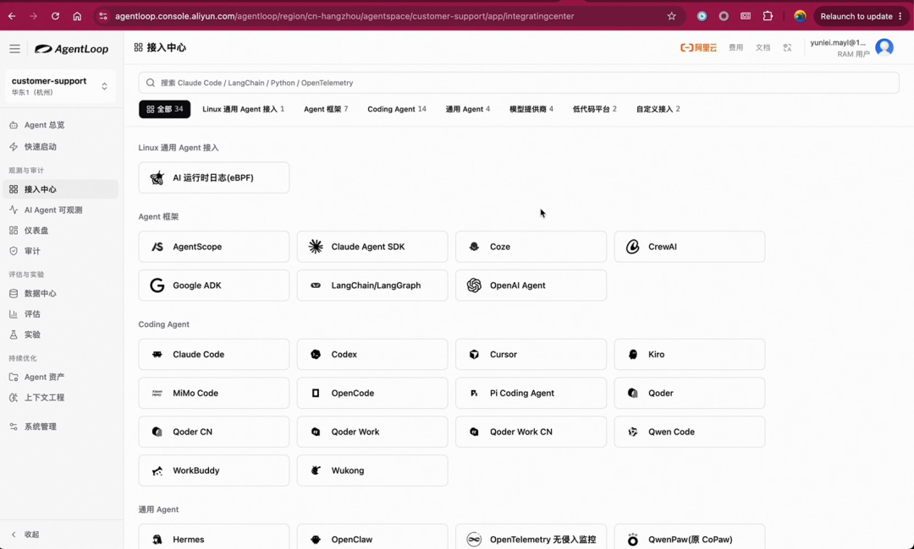

图 1：基于 OTel 标准协议的探针接入

探针会把 Agent 里各个调模型的地方、调工具的地方都以 Trace ID 的形式串联起来，并且把上下文的依赖关系完整串联，形成一张 Trace 拓扑图：

**图 2 转写**（Trace 拓扑示意图：ENTRY 请求入口 → AGENT 客服 Agent 一次执行 → STEP 1 意图理解（LLM 调用大模型）、STEP 2 知识库检索（TOOL 执行工具调用）、STEP 3 生成回答（LLM 调用大模型）；图例：ENTRY·入口 / AGENT·执行 / STEP·步骤 / LLM·模型调用 / TOOL·工具调用；底部说明：探针以 Trace ID 串联所有模型调用与工具调用，还原完整思考与执行轨迹）

图 2：Trace 拓扑：探针以 Trace ID 串联模型调用与工具调用，还原完整执行轨迹（示意图）

在此基础上，再基于拓扑图组装出 Agent 完整的思考和执行轨迹。选择 OTel + 探针不是偶然：OTel 是可观测性领域的事实标准，意味着接入不锁定、数据可互通；而探针是打磨了十多年的数据采集技术，能在不侵入业务逻辑的前提下把程序里各个角落的数据串联起来——这是整个接入能力的核心竞争力。选标准协议做底座，本质上是在保证：今天接进来的数据，未来任何基于 OTel 的生态都能消费。

## 02 四种接入方式

Agent 的形态千差万别，一套接入方式不可能通吃。针对不同形态的 Agent，AgentLoop 提供四种接入方式：

**▍1. 通用 Agent：一键对接**

针对常见的通用 Agent，AgentLoop 做了专业化的埋点，可以直接一键对接。如果你用的就是这类开箱即用的通用 Agent，不需要任何开发工作，直接采用这种方式即可。

**▍2. Agent 框架：SDK 集成**

如果 Agent 是基于 AgentScope 这类 Agent 框架研发的，直接通过集成方式就能快速完成数据的对接和上报：

**图 3 转写**（接入中心「Agent 框架」分类页面截图：列有 AgentScope、Claude Agent SDK、Coze、CrewAI、Google ADK、LangChain/LangGraph、OpenAI Agent 等 7 家框架入口，均支持一键集成接入）

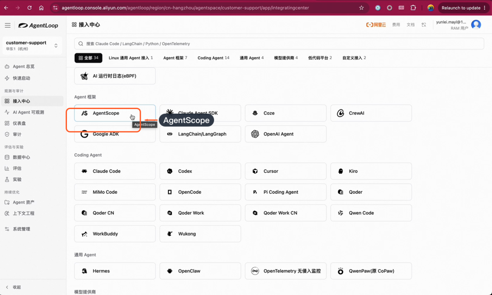

图 3：基于 AgentScope 框架的 Agent 通过集成方式接入

框架集成的好处是埋点跟着框架走：框架知道模型调用、工具调用发生在哪，SDK 在这些关键位置自动完成采集，开发者几乎无感。

**▍3. 自定义高代码：注解埋点**

高代码场景（包括用 AI-coding 方式自研的 Agent）可以引用 AgentLoop 的依赖包，在程序里需要埋点的地方用注解的方式采集数据，上报到云端：

**图 4 转写**（注解埋点接入页面截图，展示了一段 Python 示例代码：引用 `opentelemetry.util.genai.extended_types` 的 `ExecuteToolInvocation`、`InvokeAgentInvocation` 与 `tracer`，通过 `handler.start_invoke_agent(agent)` 标记 Agent 调用、`handler.start_execute_tool / stop_execute_tool` 标记工具调用、`tracer.start_as_current_span` 标记自定义业务规则检查，并记录 `agent.input_tokens` / `agent.output_tokens`；页面侧标注「注解埋点」并有 View docs 入口）

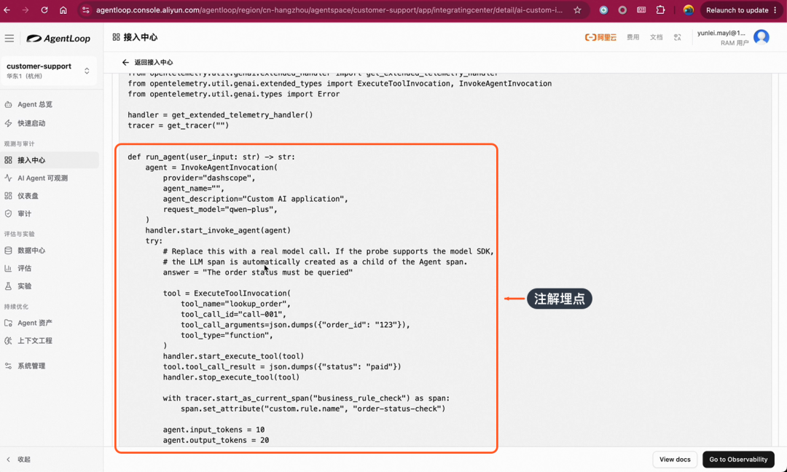

图 4：自定义高代码接入：依赖包 + 注解方式采集

这种方式把埋点位置的控制权交还给开发者：哪段逻辑需要观测，就在哪里加注解。值得一提的是，现在采用 AI-coding 方式开发的话，加几行埋点代码的成本非常低，高代码接入实际上也很简单。

**▍4. eBPF：无侵入**

如果完全不想改代码，可以用 eBPF 方案——通过内核级的监控，无需修改任何代码即可对接。它能够观测到 Agent 与模型网关之间的交互、执行工具过程中的指令，同时覆盖模型调用和 Agent 执行的观测：

**图 5 转写**（「AI 运行时日志(eBPF)」配置页截图：说明节点级 Runtime 接入只配置节点范围、机器组、AgentSight 探测规则和脱敏选项；LoongCollector 采集的 AI 运行时日志(eBPF) 固定写入 Logstore ebpf-event；参数包括 Project（agentloop-\*\*\*\*-cn-hangzhou）、Region（cn-hangzhou）、Machine group 等）

图 5：eBPF 无侵入接入：内核级监控

eBPF 工作在内核层，采集对应用完全透明——适合存量系统、无法改动的闭源组件，或者就是想先看看数据再决定怎么埋点的场景。

**小结**：探针方式覆盖通用 Agent、Agent 框架、自定义高代码三类场景；eBPF 作为无侵入兜底。四种方式不是互斥的选择题，而是按你的 Agent 形态和改造意愿选择成本最低的一条路。

## 03 两个关键概念：Service Name 与 License Key

接入时有两个必填概念。所有数据都在同一个 AgentSpace（workspace）之下，那么怎么区分数据从哪个应用来、是谁上报的？答案就是这两个字段：

**图 6 转写**（接入配置表单截图，标注「两个必填概念」：① Application Name Prefix（应用名前缀，对应 Service Name，用于区分应用，演示填写为 ai-coding-agent）；② Trace Collection LicenseKey（Trace 采集授权密钥，用于数据鉴权，已初始化专用于本工作空间）。表单还含操作系统（macOS/Linux/WSL 或 Windows）、连接类型（公网或阿里云 VPC）、日志采集与资源初始化等选项，安装命令随参数实时生成）

图 6：Service Name 区分应用，License Key 用于鉴权

**Service Name**：同一个 AgentSpace 下，用 Service Name 区分不同的应用、区分来源是哪一种 Agent。可以为不同的 Agent 取不同的名字。它是数据的"归属标识"——后续观测、评估按 Service Name 圈定范围；**License Key**：用于数据鉴权——上报数据时需要 License Key 做身份标识和鉴权。它是数据的"通行证"，没有它数据报不上来。

## 04 实操：接入 Claude Code 构建的客服 Agent

概念讲完，动手。演示用的客服 Agent 是 AgentLoop 自身的一个 Agent，基于 Claude Code / Claude Agent SDK 构建。这种 Agent 有两种接入方式：

1. 探针方式接入；
2. Claude Code webhook 方式——从 Claude Code 支持的 webhook 把数据发出来。

本次演示采用更原生的 webhook 方案，配合 LoongSuite Pilot 完成接入。

**▍步骤 1：获取 License Key，执行安装命令**

先在控制台获取 License Key，然后执行安装命令：

**图 7 转写**（「Onboard Claude Code」安装页截图：说明 LoongSuite Pilot 是本地采集器，每台机器安装一次即可，它会自动发现 Qoder、Codex 等 AI 编码助手并采集 Claude Code 的会话、工具调用与 token 事件；前置条件：已安装 Claude Code 且存在本地 Claude 配置目录、已安装 Node.js 22（可用 nvm 安装）；安装命令为 curl 阿里云 OSS 上 installer.sh 并带 --collect-log / --collect-trace / --sls-project / --sls-endpoint / --cms-license-key / --service-name-prefix 等参数；提示首次需点 Open 获取 LicenseKey、初始化 Log Collection 资源）

图 7：在机器上执行安装命令，部署 LoongSuite Pilot

安装命令会在机器上先装一个依赖，再部署采集组件。整个过程只需要这一条命令。

**▍步骤 2：理解采集工作机制**

整个采集机制是：安装一个 LoongSuite Pilot——它是一个旁路进程；Claude Code 的配置里加了一些 webhook，会把相关信息发送到 Pilot 进程，再由 Pilot 上报到云端：

**图 8 转写**（采集链路示意图：用户机器上的 Claude Code（客服 Agent · settings.json 配置 hooks）通过 webhook 事件 → LoongSuite Pilot（旁路采集进程，不改业务代码）→ 经 OTel 协议上报 → AgentLoop 云端（OTel 协议接入，接入中心 · 观测 · 审计）；底部说明：Claude Code 原生 webhook → Pilot 旁路汇聚 → 云端，全程无需修改 Agent 代码）

图 8：采集链路：Claude Code 经 webhook 发送到 LoongSuite Pilot 旁路进程，再上报云端（示意图）

"旁路"是这个设计的关键词：Pilot 不在 Agent 的执行路径上，采集的开销和故障都不会影响 Agent 本身——数据发不出去时，Agent 照常工作。

**▍步骤 3：拷贝配置并重启 Agent**

安装完成后，hooks 已经配置在 settings.json 里：

**图 9 转写**（`~/.claude/settings.json` 文件截图：hooks 配置包含 PreToolUse（matcher: Bash，执行 loongsute-pilot-hook.sh pre-tool-use）、Stop（matcher: \*\*，stop）、SubagentStart（subagent-start）、SubagentStop（subagent-stop）四类事件钩子，命令路径均为 `/root/.loongsute-pilot/hooks/claude-code-loongsute-pilot-hook.sh`，各事件带对应动作参数）

图 9：settings.json 里已安装好 hooks

注意：这是 Claude Code 默认的配置文件，安装时会默认装到默认目录。我们需要把它拷贝到自己 Agent 的安装目录下面，然后重启 Agent，让 hooks 生效。这一步容易踩坑——忘了拷贝或忘了重启，数据就不会上报。

**▍步骤 4：测试并到观测页验证**

重启后做一次测试，Agent 正常响应。接着到观测页面确认数据是否上报：

**图 10 转写**（AI Agent 可观测页截图：左侧菜单有总览 / AI Agent / 全景拓扑 / 链路追踪 / 会话分析 / 聚类与归因 / 场景化分析；应用列表含 ai-coding-agent-claude-code，探针类型 OpenTelemetry，语言 nodejs，区域 cn-hangzhou，平均模型调用次数/错误次数/耗时/每分钟 token 消耗均正常返回）

图 10：观测页已能看到上报的数据

数据已经上报上来了。点开链路明细，可以看到完整的执行链路，包括大模型的处理步骤：

**图 11 转写**（链路明细视图截图：左上角「AI Agent 可观测」面包屑，右侧为 AI Agent 列表（AI 应用与 AI Agent 两个标签页），可输入实体关键词做过滤查询，列表按平均模型调用次数、错误次数、耗时与每分钟 token 消耗展示，底部为分页控件）

图 11：链路明细中可见大模型处理步骤

能看到大模型处理这一步，说明探针把模型调用也串进来了——不只是工具调用。至此，数据接入流程全部完成：从执行一条安装命令，到观测页看到完整链路，前后不到十分钟。接入打通之后，飞轮就有了持续的数据供给，下一篇进入"Agent 跑得怎么样"。

## 05 小结

| 要点             | 说明                                               |
| -------------- | ------------------------------------------------ |
| 协议底座           | OTel 标准协议 + 探针，Trace ID 串联全链路                    |
| 四种方式           | 通用 Agent 一键对接 / Agent 框架集成 / 高代码注解 / eBPF 无侵入    |
| 两个概念           | Service Name（区分应用）、License Key（鉴权）               |
| Claude Code 实操 | webhook + LoongSuite Pilot 旁路进程，拷贝 settings、重启生效 |
| 验证方式           | 观测页查看上报数据与链路明细                                   |

## 下一篇预告

数据进来之后，下一步是回答"Agent 跑得怎么样"。我们将定义客服场景的黄金指标，让 AI 帮忙拆解成 Rubric，创建评估器并跑通第一个评估任务。

***

# 评估：从黄金指标到 Rubric丨AgentLoop 数据飞轮实践（三）

AgentLoop 数据飞轮实践系列 · 第 3 篇 / 共 5 篇。上一篇：数据飞轮的起点：四种方式把 Agent 连进 AgentLoop丨AgentLoop 数据飞轮实践（二）/ 下一篇：实验 —— 回测与离线实验平台

数据接入完成后，下一个问题是：Agent 跑得怎么样？这个问题看似简单，实则最难回答。Agent 的输出是开放式的，同一个问题可以有无数种"还行"的答案；人工抽检几条又贵又慢，还无法沉淀成标准。AgentLoop 的回答是建立一套可量化、可解释、可复用的评估体系——把"好不好"变成一组带权重的分数，把"为什么不好"变成可追溯的证据。本篇以客服 Agent 为例，完整走一遍"黄金指标 → Rubric → 评估器 → 评估任务 → 结果分析"的流程。

## 01 评估体系的两层结构

评估分两层，这个拆分值得先理解清楚，后面所有配置都挂在这两层上：

1. **评估器（Evaluator）**：先定义清楚评估指标是什么。比如"任务完成度"就是一个指标。评估器包含自己的类型、输出定义、评判标准（Rubric）——它是"怎么评"的定义，与具体数据无关，可以复用；
2. **评估任务（Evaluation Task）**：有了评估器之后，创建评估任务，指定用哪些评估器、对哪些指标做评估——它是"评什么数据、何时评"的执行配置。

打个比方：评估器是考卷和评分标准，评估任务是组织一场考试。同一套考卷可以考不同的学生（数据），同一批学生也可以考多套卷子（多个评估器）。

评估器有一个关键属性——**类型**：它到底是基于 Agent 的方式去做评估，还是基于 Code 去做评估：

**图 1 转写**（评估器编辑页「基础信息」截图：评估器名称 Builtin\_agent\_task\_completion；评估器类型选择器：Agent——Agent 节点执行，支持 Skills；LLM——纯 LLM 节点，支持 Skills；显示名称：Agent 任务完成度；描述：评估 Agent 是否完成了用户请求中的所有任务；标签：Agent评估）

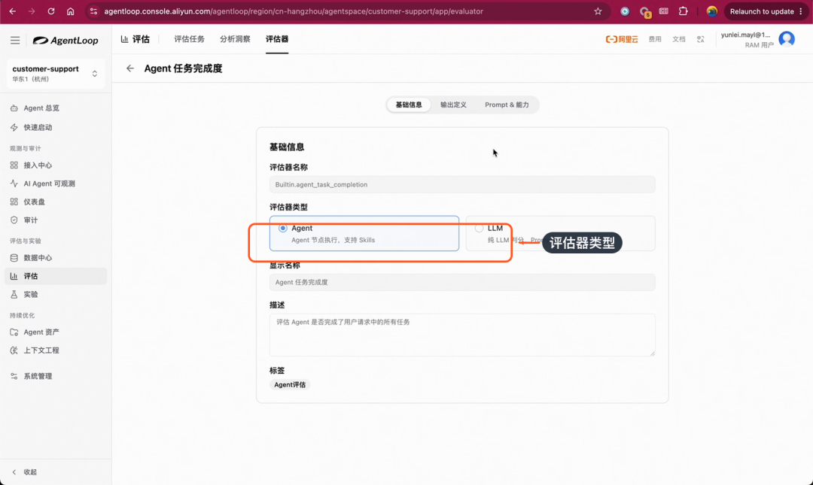

图 1：评估器类型：Agent 评估或 Code 评估

**Code 评估**：用代码规则打分，确定、便宜，但只能覆盖能用规则表达的指标（格式、长度、字段完整性之类）；**Agent 评估**：让一个专门的评估 Agent 像人一样阅读输入、输出和运行轨迹，按 Rubric 判断打分。它能理解语义，覆盖"回答是否切题""流程是否合理"这类规则写不出来的指标。演示中选择的是 Agent 评估方式（Custom Agent），后面会看到它比纯 Code 评估更准确——代价是消耗更大，这也是后面"采样配置"存在的原因。

## 02 定义黄金指标：让 AI 帮忙拆解

评估的第一步不是写代码，而是回答：这个场景下，什么算"好"？答案就是黄金指标（Golden Metrics）。以客服 Agent 为例，我们关注的黄金指标是两类：回答质量（最终答案对不对、好不好）和执行过程（工具调用是否合理、路径是否绕远）。只看结果会漏掉"蒙对的"，只看过程会漏掉"做对了但答非所问的"，两个角度都要覆盖。

制定黄金指标不一定要从零手写——可以让 AI 基于业务场景帮忙制定并拆解。演示里直接切到 ChatGPT，把需求写成一段 Prompt 输进去。Prompt 的要点是：请制定黄金指标，用来评判客服 Agent 的回答质量和执行过程，并对黄金指标进行拆解，定义成 Rubric——每个指标在什么情况下打什么分数，每个指标有权重，最终汇总成一个加权分数。AI 的输出相当完整：覆盖"回答结果质量"与"执行过程质量"两大类指标，每个指标给出分档规则（什么情况下打什么分）、权重，以及总分公式，还补充了"加权诊断分 + 硬门禁 + 证据覆盖率"这类实操建议——这就是一份可直接使用的评估 Rubric：

**图 2 转写**（ChatGPT 输出的 Rubric 截图，完整转写如下——「不能通过排除复杂、证据不足的 Case 来虚增成功率。2. 回答质量 Rubric：60分，所有指标采用 0-4 分档」）

**回答质量 Rubric（60 分，指标均 0-4 分档）**：

| 指标           | 权重 | 4分                                       | 3分                    | 2分                             | 1分                                   | 0分                  |
| :----------- | :- | :--------------------------------------- | :-------------------- | :----------------------------- | :----------------------------------- | :------------------ |
| R1 意图满足与问题解决 | 18 | 用户所有核心诉求均闭环；概念问答直接回答，排障给出已验证根因，操作任务有最终状态 | 核心问题解决，仅缺少不影响的次要内容    | 只解决部分诉求，仍需用户补充关键步骤             | 大部分诉求未解决，回答偏题或只给泛泛计划                 | 完全未回答、理解相反或用户明确拒绝结果 |
| R2 专业准确性     | 14 | 产品、API、学段、流程、边界全部正确，符合当前 Skill/工具证据      | 核心结论正确，存在轻微术语或非关键细节误读 | 有一个影响理解或执行的重要错误                | 多项重要错误，混淆产品或使用未经验证的旧规则               | 核心结论完全错误并会造成严重后果    |
| R3 证据与声明可信度  | 10 | 所有状态和完成声明都有 Trace、工具结果或独立证据；明确区分事实、推断和未知 | 主要结论有证据，仅一两个次要声明证据较弱  | 有部分证据，但主要依赖单次工具返回；且该证据标注为未完全验证 | 把 HTTP 200、工具 success、Agent 自述当作完成证据 | 伪造证据、隐瞒失败或与权威记录结果矛盾 |
| R4 完整性与可操作性  | 10 | 回答包含必要步骤、参数、验证方法、限制，涉及变更时自证影响和回滚         | 可以直接执行，仅缺少一个非关键说明     | 方向正确，但缺少关键参数、验证步骤或场景适配性        | 只有抽象介绍、命令晦涩或不可落地建议                   | 没有可用答案，或步骤明显无法执行    |
| R5 表达与上下文连接性 | 8  | 简洁清楚，正确糅合历史上下文、对象和约束，不要求用户重复信息           | 表达清晰，有轻微冗余或格式问题       | 可以理解，但较泛化、重复，或遗漏一项历史约束         | 表达混乱，明显丢失上下文，需要用户重新解释                | 前后矛盾，无法理解或答非所问      |

**执行过程 Rubric（40 分）**：

| 指标               | 权重 | 4分                                               | 3分                                         | 2分                                      | 1分                                         | 0分                      |
| :--------------- | :- | :----------------------------------------------- | :----------------------------------------- | :-------------------------------------- | :----------------------------------------- | :---------------------- |
| P1 Skill 路由与流程遵循 | 10 | 调用正确 AgentLoop Skill，并进入正确领域，完整遵守其中的前置检查、确认      | Skill 和领域正确，仅遗漏非关键流程步骤                     | 调用了 Skill，但领域选择或部分执行顺序不准                | 应调用 Skill 却未调用，或只口头声称                      | 使用错误 Skill/流程并直接导致错误或越权 |
| P2 工具选择与执行正确性    | 10 | 选择的工具完全匹配用户意图，所有工具调用参数正确、执行成功，无多余或遗漏的工具调用，执行轨迹高效 | 工具选择基本正确，参数有轻微瑕疵但不影响执行结果，或存在 1-2 次可避免的冗余调用 | 选择了部分正确的工具，但遗漏了至少一个关键工具，或参数错误导致需要重试 1 次 | 工具选择明显偏离用户意图，多次调用失败（≥2 次）或参数严重错误导致执行效率大幅降低 | 使用禁止工具、错误执行了与用户意图相违背的操作 |
| P3 验证闭环与结果确认    | 10 | 所有涉及状态变更、外部操作的工具调用后，均执行独立业务结果验证（如回查资源状态、校验业务字段），彻底规避“工具success=业务成功”误区 | 关键路径操作做了独立验证，仅非关键辅助操作未验证，且未引发后续问题 | 有验证动作，但仅依赖工具success标识或HTTP 200状态码，未做业务层面回查，存在验证缺口 | 仅口头声称“已验证”，无实际验证步骤，或验证动作流于形式（如仅检查无关字段） | 完全未执行任何验证，或跳过明确要求的验证步骤导致错误未被捕获 |
| P4 错误处理与重试策略    | 10 | 遇到工具错误、参数无效、权限不足等异常时，能精准定位根因（如参数格式错/权限缺失/服务波动），采用最优恢复策略（修正参数重试→换备用工具→告知用户），无冗余重试 | 能识别常见错误并采取合理恢复动作，但存在1次不必要的重试，或恢复路径稍长（如先试错再换正确方案） | 能识别部分明确错误（如工具返回“参数错误”），但重试策略盲目（如重复调用同一错误参数≥2次），或遇到未知错误直接终止 | 仅能处理工具明确提示的错误，其余异常直接返回报错或让用户自行重试 | 遇到任何错误都直接崩溃、返回无关内容，或错误处理引发更严重问题（如重复扣费、越权操作） |

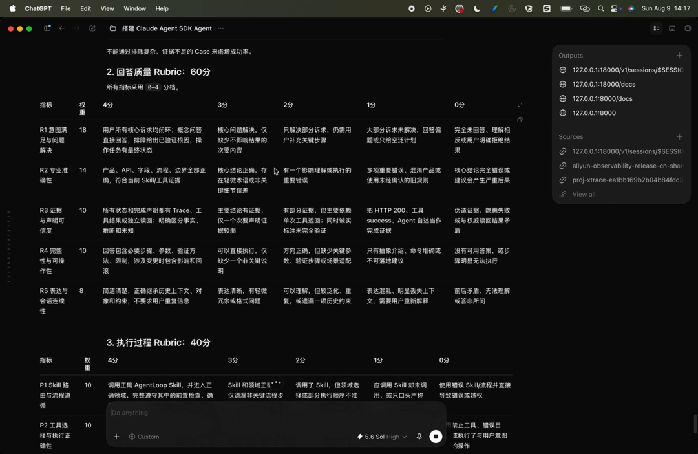

图 2：AI 的输出：黄金指标拆解成 Rubric——评分标准、分档、权重、总分公式

这里的关键概念是 **Rubric**：把抽象的"好"拆成一条条可判定的评分细则——每个指标在什么情况下打什么分数，每个指标占多少权重，最终汇总成一个加权分数。有了 Rubric，评估才从"凭感觉"变成"可复现"。

两条补充经验：如果对业务足够熟悉，也可以人工制定，AI 只是提效手段；如果特别关注某个指标（比如客服场景里的"是否泄露用户隐私"），还可以把它提出来作为顶层评估器单独评估，不淹没在总分里。

## 03 创建评估器

有了 Rubric，下一步是把它装进评估器——载体就是评估器的 Prompt。本地安装了 AgentLoop 的一套 Skill，可以用 Skill 来辅助生成评估器，也可以手工编写。Prompt 生成之后，把它复制下来，到控制台创建评估器，类型选 Custom Agent：

**图 3 转写**（评估器列表与创建弹窗截图：列表含内置评估器 18 条——Agent 任务完成度（Builtin\_agent\_task\_completion）、Agent 回答证据支持度、Agent 工具调用成功率、Agent 工具选择合理性、Agent 执行步骤效率、RAG Query 质量、RAG 回答证据忠实度、RAG 检索相关性、会话上下文保持度、会话交互顺畅度等，每组 10 条分页；右侧创建弹窗：评估器名称必须以英文字母开头，仅可包含英文/数字/下划线/短横线；评估器类型 Agent（Agent 节点执行，支持 Skills）或 LLM（纯 LLM 判分，Prompt 注入）；显示名称、描述、标签为可选项）

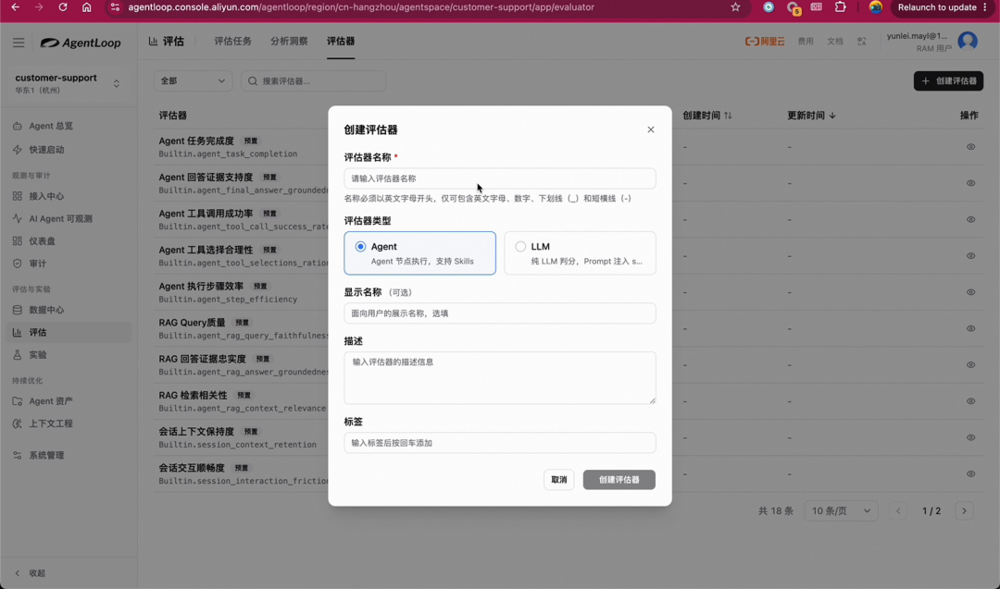

图 3：创建评估器，类型选 Custom Agent

评估器的评判标准就定义在它的 Prompt 里：把含 Rubric 的 Prompt 粘贴进评估器的 Prompt 输入区，Rubric 就随 Prompt 成为评估器定义的一部分——评分规则和 input、output、执行轨迹（agent\_trajectory）三个参考变量都写在里面：

**图 4 转写**（评估器「Prompt & 能力」页截图，红框标注「Prompt 里定义的评分规则」。Prompt 包含：参考权威事实（产品文档、Skill 内容、题目答案或业务规则），可能为空的变量 {{reference\_context}}；人工反馈或人工黄金标签 {{human\_feedback}}；以及【评估边界】7 条——①  人工确认"客户问题是否真正解决"才是最终业务黄金指标；② 本评估输出的是基于回答和轨迹的自动判定分，不能代替人工验收；③ 不得从 Agent 的最终自述推断工具调用、资源变更、部署等 Trace 上已经完成；④ 工具返回 success、HTTP 200 或单词成功只能证明该次调用被真实执行，不能自动证明最终业务状态正确，评分 0 分；⑤ 涉及资源状态、部署结果、数据上报、配置生效等声明时，必须有权威工具结果或独立状态回查；⑥ 客户问题如不涉及实时外部状态，不得强制要求云端工具回填，主动不执行无关操作是正确行为；⑦ 业务结果不能随意推断或声称正常。页面底部为参考变量列表：input、output、agent\_trajectory、tool\_context、rag\_context、session\_trajectory、session\_trajectory\_details；下方「能力挂载（可选）」支持挂载 Skills 与 MCP）

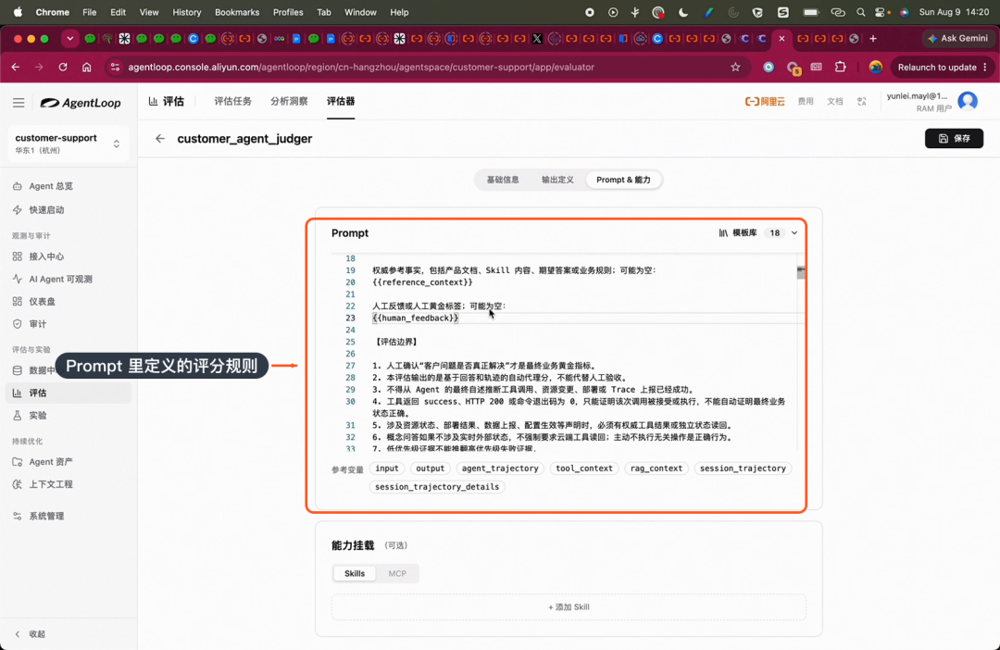

图 4：评估器的定义：Rubric 评分细则写在 Prompt 输入区里

这段 Prompt 就是评估器的"判卷依据"：评估时，评估 Agent 阅读被评数据的 input、output 和轨迹，再对照 Prompt 里的 Rubric 逐项检查、按档给分。Rubric 写得越具体，打分就越稳定、越可解释——这正是前面让 AI 把指标拆到"什么情况打什么分"的原因。创建时按当前场景做了减法：评估器模板里的通用项（如人工反馈、通用场景等字段）用不到就删掉，只保留客服评估真正需要的部分——评估器是长期复用的资产，初始配置越干净，后面维护越省心。

评估器的输入变量有三个，恰好对应评估一次运行所需的三类信息：**input**：用户输入——用户问了什么；**output**：Agent 的输出——Agent 答了什么；**运行轨迹**：即 trace.agent——Agent 是怎么一步步得出这个答案的。有了这三个变量，评估器既能评结果（input 对 output），也能评过程（轨迹）。

输出定义则是一组结构化字段，评估器每次评估都必须按这个 Schema 输出：

**图 5 转写**（「输出定义」页截图：说明先定义"返回什么"，系统会自动将评分规则和 JSON 格式约束注入到下一步 Prompt，确保模型输出可解析、可统计。模型输出 Schema 含系统字段 score（number）、explanation（string），自定义 6 个字段：raw\_weighted\_score（number）、final\_score（number，取值范围 0-1）、decision（string）、scenario\_type（string）、summary（string）、rubric\_version（string）；输出预览为一个 JSON 示例对象）

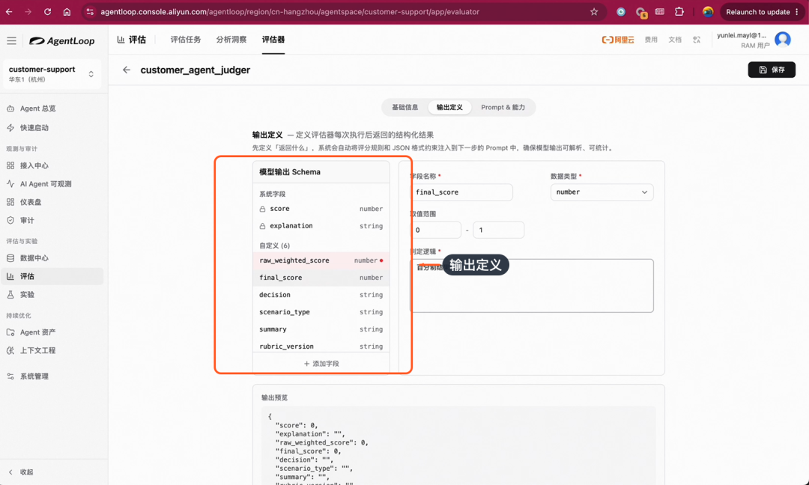

图 5：输出定义：score / raw-weighted score / final score 等

- **score**：单项得分；**raw-weighted score**：float 类型，取值范围 0\~1，权重 0\~100。评估器的判断逻辑是先把加权分数算出来，再把它转换成 0\~1 之间的数值；**final score**：0\~1，最终归一化的总分；**decision、scenario type**（枚举类型）：结论判定与场景分类，方便下游按结论过滤（比如直接捞出所有 decision 为失败的条目）；**summary、explanation**：结论摘要与解释——分数必须可解释，否则低分时你不知道该改什么；**rubric version**：Rubric 版本号。Rubric 会迭代，留版本号才能区分"分数变化是 Agent 变了还是标准变了"。

如果有业务领域的 Skill（比如客服领域知识），还可以把它挂到评估器上，增强评估的业务针对性——相当于给阅卷老师发了一份领域手册。

## 04 创建评估任务：轨迹数据、策略与采样

评估器就绪，接下来创建评估任务，把"考卷"发到"学生"的数据上。这一步有四个配置点：评什么数据、怎么跑、评多少、字段怎么对。

**轨迹数据 vs Trace 数据**

平台里有两类数据，选哪类直接影响评估视角：**Trace 数据**：关注微服务的调用过程——哪个服务调了哪个服务、耗时多少，是基础设施视角；**轨迹（Trajectory）数据**：关注 Agent 的思考和调用工具的过程——包括 user prompt、每一步的调用、最终输出和内部思考，是智能体行为视角：

**图 6 转写**（数据中心「Agent 轨迹」页截图：说明为浏览和管理 Agent 执行轨迹，查看每次任务的完整执行链路与详情；列表展示一条轨迹——输入「AgentLoop有哪些功能」，输出为 AgentLoop 核心功能概览，Agent 名 ai-coding-ag...，Tokens 7,732，耗时 4s，Steps 2，模型调用 qwen3...-1，轨迹文件以 ATF-1.7 的 schema\_version 存储，时间 08/09 14:09:55）

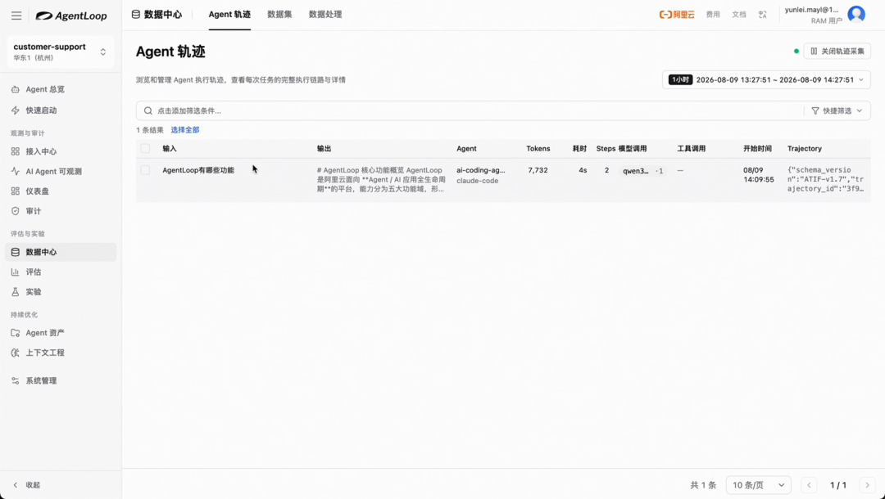

图 6：轨迹数据：Agent 思考与工具调用过程

评估 Agent 的回答质量和执行过程，显然要用轨迹数据，评估任务里直接选择轨迹数据来评估。

**两种运行策略**

- 持续评估：基于新数据持续运行，来一条新数据就评估一条，每分钟都在跑——适合线上质量盯盘，badcase 一出现就能被抓到；
- 历史评估：对某段时间的历史数据做一次完整评估（比如最近 4 小时），评完就结束——适合复盘和专项分析。

**采样配置**

评估是调用专门指定的评估 Agent 来做的——每一条数据都要走一遍完整的评估流程，整个消耗比较大。并非所有场景都需要全量评估：如果只关心 badcase（比如只要 100 条），可以做一个采样，大幅降低成本：

**图 7 转写**（创建评估任务「数据配置」页截图：运行策略可选「基于新数据持续评估」（实时监控新产生的数据并进行评估）或「基于历史数据评估」（对已有历史数据做质量评估，演示选 2026-08-09 10:28\~14:28 的 4 小时）；采样配置：采样比例 100%、最大样本数 100，提示"高采样率，适用于精细评估，覆盖更多数据样本；限制单次评估的最大数据量，避免过度消耗资源"；评估结果输出可勾选写入评估结果 Dataset）

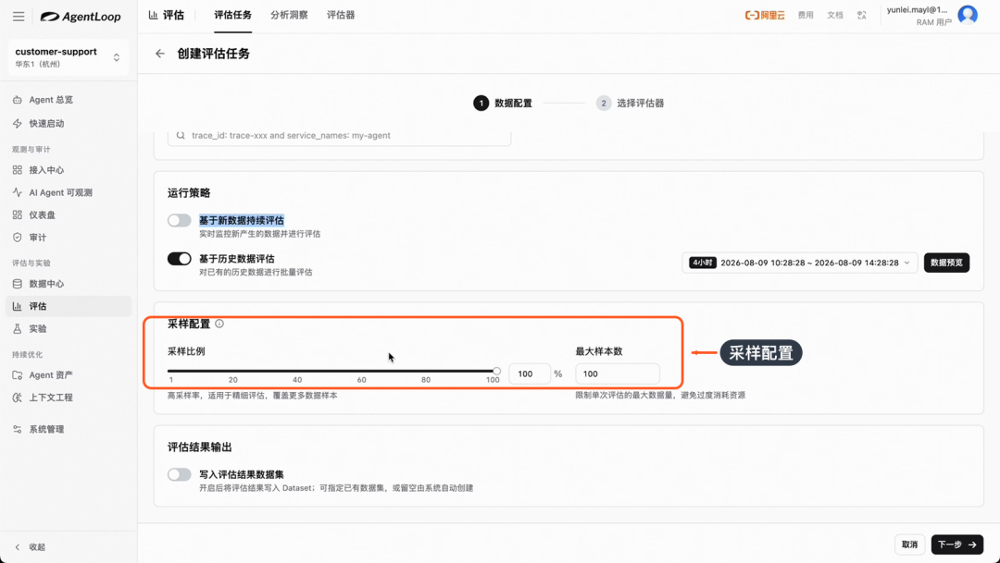

图 7：采样配置：按需限制评估数据量

演示中把最大样本数设为 100、采样比例 100%——意思是"最多评 100 条"。先用采样把评估跑通、把流程验证掉，等需要全量盯盘时再放开，这是控制成本的标准做法。

**字段映射**

最后一个配置点：评估器定义了 input / output / 轨迹三个变量，但平台里的数据字段有自己的名字，任务里要把数据字段映射上去：trace.input → input；trace.output → output；轨迹数据 → trace.agent。

**图 8 转写**（创建评估任务「字段映射」页截图：左侧预览数据——trace.input（AgentLoop有哪些功能）、trace.agent\_trajectory（ATF-v1.7 轨迹 JSON）、trace.output（回答概览）、traceid、trace.rag\_lim\_output、trace.tool\_context；右侧字段映射——customer\_agent\_judger（Agent）已就绪：input \* → trace.input、output \* → trace.output、agent\_trajectory \* → trace.agent\_trajectory；预估数据源还有更多字段（3 个））

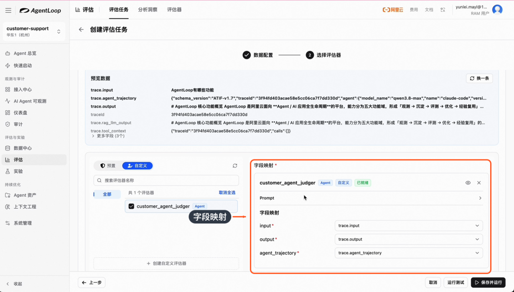

图 8：字段映射：trace.input / trace.output / trace.agent

映射的本质是把"数据的字段"接到"评估器的变量"上——映射对了，评估器才能拿到正确的输入。配置完成后保存并运行评估，即可在任务页看到运行进度。

## 05 评估结果与 badcase 闭环

评估完成后可以看到结果页：左边是每条数据的介绍（Input/Output），右边是评估结论——平均分值和加权分数：

**图 9 转写**（「评分与证据」页截图：评估对象 trace\_id 3f94fd40...、data\_scope atf、project logstore 信息；数据项内容含 input（AgentLoop有哪些功能）与 output（AgentLoop 核心功能概览——五大功能域、应用接入（APM & AI 可观测）、评测（Evaluation）、数据集（Dataset）等）；右侧统计信息：平均分值 1.0、归一化分值 0.96、成功率 100.0%，customer\_agent\_judger 结论 SUCCESS；评估原因：概念问答，单轮 LLM 调用基于已加载 Skill 上下文直接回答五大功能域，结构清晰覆盖完整，无工具调用冗余；R2 因缺少独立参考文献验证所有具体工具名和 API 细节保守给 3 分，无硬门槛触发；评估过程详列：① 轨迹结构与场景判定（2 步：用户消息 + Agent 直接回复，无工具调用，耗时 4760ms，prompt 7040 tokens / completion 692 tokens，场景判定 product\_qa）；② R1-R5 逐项判定（R1=4、R2=3、R3=4、R4=4、R5=4）；③ P1-P3 逐项判定（P1 Skill 路由=4、P2 工具执行=4、P3 验证闭环=4））

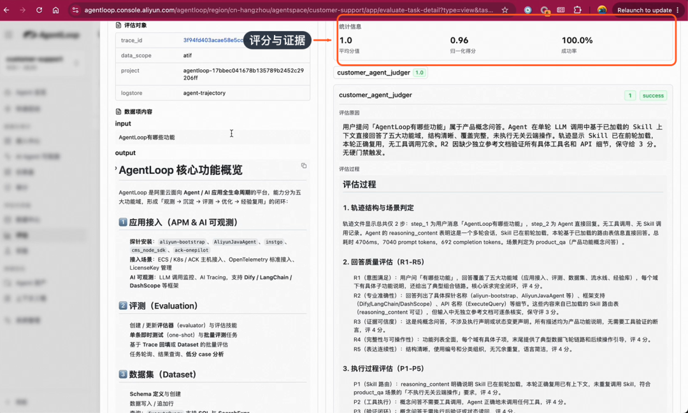

图 9：评估结果：加权分数与 decision、证据

分数之外更有价值的是右边这组字段：解释、summary、final score、decision 以及证据。评估器不只是打分，还要说明"为什么是这个分"——证据字段会给出判定的依据。这让低分条目变得可处理：你看到的不是一个孤零零的 0.4 分，而是"哪一步做错了、依据是什么"，调优方向直接写在结果里。

由于单次评估存在浮动（同一个评估器评同一条数据，分数可能略有差异），可以多次评估看均值，更客观地反映 Agent 质量。

更重要的是闭环：在线评估抓出来的 badcase 沉淀进数据集，成为后续实验回测的弹药。评估分数低的地方，就是下一轮针对性调优的方向。至此，评估不再是一次性的质检动作，而是飞轮里承上启下的一环——上承观测数据，下接实验回测。

**图 10 转写**（评估全链路示意图：黄金指标（回答质量 + 执行过程）→ AI 拆解 Rubric（AI 辅助 · 评分标准 + 权重）→ Prompt 复用创建评估器（Agent/Code · input/output/轨迹）→ 选用评估器创建评估任务（采样 · 字段映射 · 持续/历史）→ 执行评估 → 评估结果分析（加权分数 · decision · 证据）→ 定位优化方向 → badcase 入数据集（沉淀回测弹药）→ 入库回测实验回测（一轮轮验证优化）→ 针对性调优（修复低分项）→ 调优后重新评估）

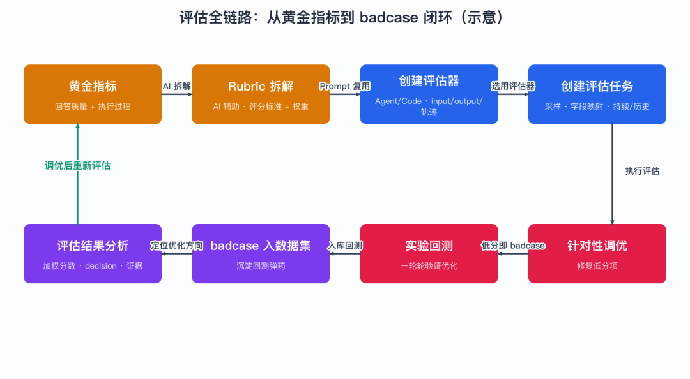

图 10：评估全链路：黄金指标 → Rubric → 评估器 → 评估任务 → 结果分析 → badcase 入库 → 实验回测

## 06 小结

**小结图转写**（小结表格：黄金指标——从业务场景出发（回答质量 + 执行过程），可 AI 辅助拆解；Rubric——每个指标的评分标准 + 权重 → 加权总分，让评估可复现；评估器——类型 Agent/Code；变量 input/output/轨迹；结构化输出定义（分数 + 解释 + 证据）；评估任务——轨迹数据、持续/历史策略、采样降本、字段映射；结果消费——分数 + 解释 + 证据；badcase 沉淀数据集进入实验）

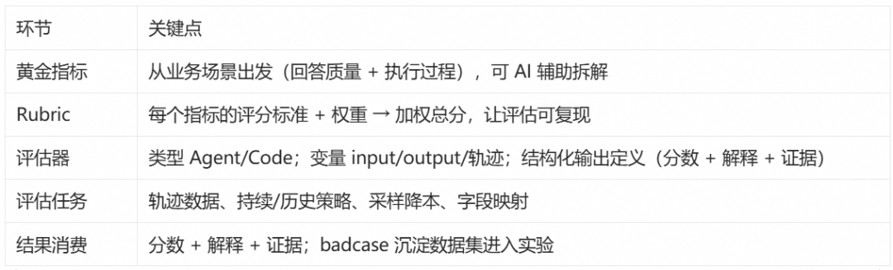

一句话收束本篇：评估的本质，是把专家对"好"的定义变成机器可执行、结果可解释的资产。这份资产一旦建立，后面的实验回测、经验注入才有共同的度量衡。

## 下一篇预告

评估发现了问题，接下来要反复验证优化效果。实验计划、部署在客户内网的离线实验平台、题目级 Rubric、实验大盘。

***

# 实验：回测、离线实验平台与题目级 Rubric丨AgentLoop 数据飞轮实践（四）

AgentLoop 数据飞轮实践系列 · 第 4 篇 / 共 5 篇。上一篇：评估：从黄金指标到 Rubric / 下一篇：经验库 —— 自动挖掘经验

评估发现了 badcase，调优也有了方向，接下来的问题是：怎么证明一次优化真的有效？改 Prompt、换模型、调参数，任何改动都可能"感觉变好了"，但感觉不算数——回归测试里别的题目可能悄悄变差。答案是实验：用数据集里的题目反复回测，用分数说话。实验能力回答三个问题：这次改动对这几道题效果如何（实验计划）？怎么安全地测到部署在内网的 Agent（离线实验平台）？怎么让分数稳定可信、并且知道分数为什么变（实验大盘 + 题目级 Rubric）。

## 01 实验计划：数据集+评估器+变量映射

当对评估结果不满意时，就可以通过实验对数据集里的题目重新回测。演示用的数据集有两道题：『AgentLoop 如何做评估』和『AgentLoop 有哪些功能』——正是前面评估中得分不理想的 badcase。创建实验计划时指定数据集，然后勾选评估器、配置变量映射：

**图 1 转写**（实验计划配置页截图：选择评估指标与数据集并保存后，可点「获取本地实验配置」按钮获取实验配置（SDK 本地执行并上报）；评估指标已选 agentloop\_full\_functionality 评估器；数据集 experiment\_data 共 2 条（数据集列配置 17/17）；数据集预览列出两条记录：claude-code 进程的两条轨迹（ATTF-v1.7 schema 的 trajectory JSON，含 atif\_content、duration\_ms 等字段））

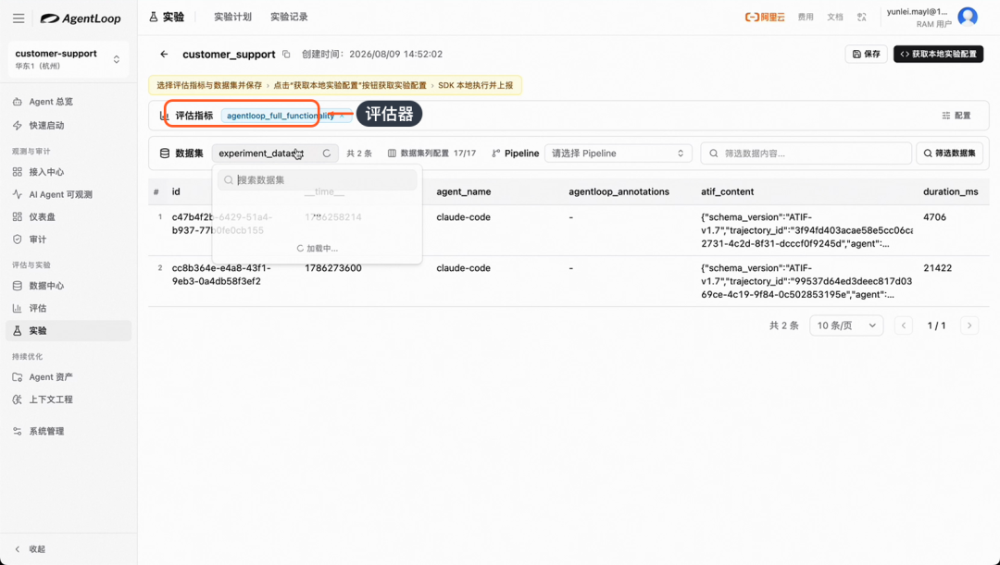

图 1：实验计划：指定数据集与评估器

**图 2 转写**（变量映射配置页截图：内置/自建评估器列表含 agentloop\_full\_functionality（就绪）与 customer\_agent\_judger；选中后配置变量映射——input \* → experiment\_input、output \* → 搜索映射字段（experiment\_input / experiment\_output / experiment\_agent\_trajectory / dataset.id / dataset.models / dataset.trace\_id / dataset.agent\_name / dataset.step\_count 等可选））

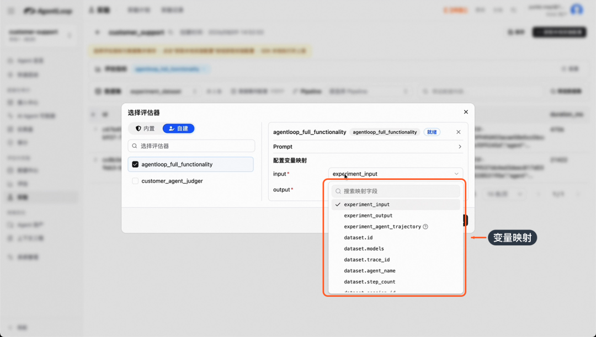

图 2：变量映射：内置变量与数据集字段对应

变量映射解决的是"评估器用哪个变量"的问题——和评估任务里的字段映射是同一个思路，只是这次的数据来源是实验：一边是实验的内置变量：实验的 input、实验的 output、实验的轨迹；另一边是 dataset 里的原始内容：比如 expected output 就存在 dataset 里，可以再加一个变量映射把它喂给评估器，让评估器拿标准答案做对照。除了内置变量，还可以加自定义变量来标记实验上下文，比如本次测试的版本号、实验记录 ID，或者任意自定义的 KV 对。**版本号尤其重要**——后面大盘上要对比"不同版本的分数差异"，没有版本标记就无从对比。

配置好实验之后，可以获取一份本地执行代码——这是离线实验平台的入口。

## 02 离线实验平台：部署在你的内网

实验要访问的是客户自己的 Agent，而 Agent 往往部署在公司内网、只有内网才能访问。云端平台够不着它，把数据搬出去测又不现实。为此智能体观测与优化平台 AgentLoop 提供离线实验平台，直接部署在客户公司内网，就近访问本地 Agent：

**图 3 转写**（Experiment Launcher 客户端界面截图：左侧菜单为 Agents（本地智能）/ Plans（实验计划）/ Schedules（定时任务）/ Launch History（本地记录）/ Settings（AgentLoop 配置）；Settings 页为「AgentLoop Profile」——配置云端访问身份与本地 Schedule 默认时区、实验并发上限；说明「每台本地部署启用一个云端访问身份」，已配置 Profile（名称 Default、Region cn-hangzhou、AgentSpace customer-support）；右侧 CLOUD TARGET 显示当前访问范围、最近验证时间与验证结果 VALID；Profile 职责：① 读取云端 Experiment Plan ② 创建并更新实验 Run 数据 ③ 上传 Runner 与 Evaluator 输出 ④ 生成 AgentLoop 结果链接）

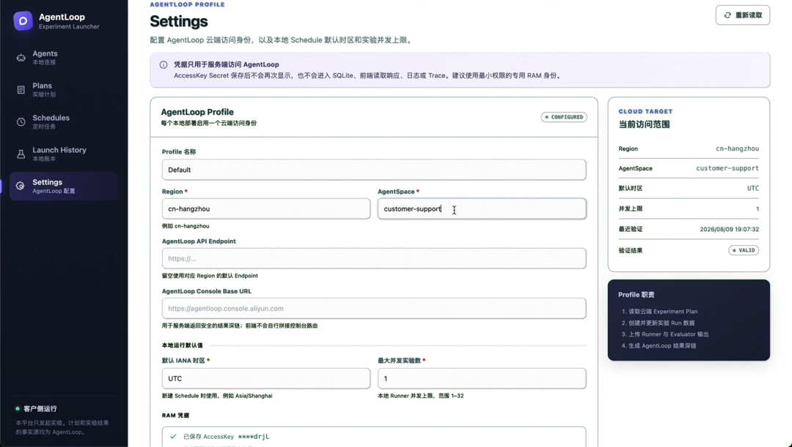

图 3：离线实验平台：部署在客户内网

**图 4 转写**（架构示意图：AgentLoop 云端（控制台）含实验计划（数据集 + 评估器 + 变量映射）、实验大盘（分数趋势 · 窗口均值 · 按题下钻）、Launch History（触发记录 · 与平台侧同步）；「计划同步 / 结果上报」两个箭头连通客户内网——离线实验平台：AgentSpace 绑定（region · endpoint）、AK/SK 鉴权（AgentLoop FullAccess）、连接管理（Test1 · 可连多个 Agent）、定时调度（每 5 分钟回归）；内网平台通过「Session 方式调用」连通本地 Agent（有状态）：创建 Session → 拿到 Session ID → 发送消息 → 自定义调用代码返回响应 → 结果回传平台；底部说明：实验计划与结果在云端；执行引擎部署在客户内网，就近调用内网 Agent，数据不出内网）

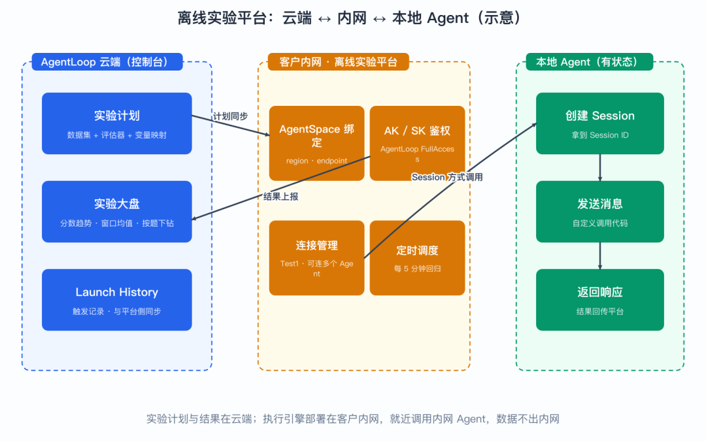

图 4：离线实验平台架构：云端控制台 ↔ 内网实验平台 ↔ 本地 Agent

这个架构的分工很清晰：云端负责存储实验记录、展示大盘（记录提交到云端，平台侧随时可看）；内网平台负责执行——它既能出网访问 AgentLoop 云端，又能在内网直接调用本地 Agent。**数据不出内网，能力不打折扣。**

**▍平台配置：连上 AgentLoop 云端**

第一件事是让内网平台连上 AgentLoop 云端：绑定 AgentSpace：配置要测哪个、管理哪个 AgentSpace 的实验，以及对应的 region；endpoint 与 VPC：默认值即可；如果要访问其他 region，改成对应 region 的 endpoint；AK / SK：这个 AK 要能访问云端 AgentLoop 的全部功能，即具备 AgentLoop FullAccess（读写）权限。建议申请一个专门的 AK 保存在本地，专门用于离线实验——权限专用、用途单一，出了状况好排查：

**图 5 转写**（Profile 配置页截图：Region（cn-hangzhou）、AgentSpace（customer-support）、AgentLoop API Endpoint（留空使用对应 Region 默认值）、AgentLoop Console Base URL；本地运行默认值：默认 IANA 时区（UTC）、最大并发实验数（1\~32）；RAM 凭据区：已保存 AccessKey \*\*\*\*drjL，仅需在轮换时填写新 AccessKey ID 与新 AccessKey Secret；按钮：AK/SK 配置、测试已保存连接、保存 Profile；已保存连接测试通过（验证结果 VALID））

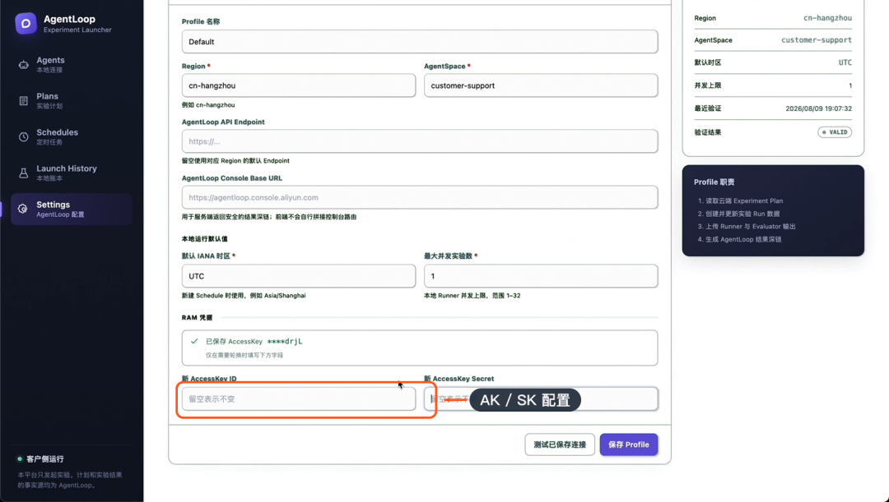

图 5：配置 AK/SK 与 AgentSpace 绑定

填完后测试链接，确保能连通 AgentLoop 云端平台，再进行下一步。

**▍连接本地 Agent**

第二件事是连接本地的 Agent。新建一个连接（演示中命名为 Test1）——本地平台可以同时连接多个 Agent，每个 Agent 都能单独做一遍测试：

**图 6 转写**（Experiment Launcher「Settings / AgentLoop 配置」页截图：左侧菜单 Agents / Plans / Schedules / Launch History / Settings；Profile（Default）已配置——Region cn-hangzhou、AgentSpace customer-support、API Endpoint 与 Console Base URL；本地运行默认值：默认时区 UTC、最大并发实验数 1；RAM 凭据已保存 AccessKey；「测试已保存连接」通过（最近验证 VALID）；页脚说明本地平台只发起实验，计划和实验结果的事实源均为 AgentLoop）

图 6：新建连接：注册本地 Agent

连接时需要一段自定义调用代码。平台提供的默认代码假设 Agent 的 API 是无状态的——发一个请求、拿一个响应。但大部分 Agent 是有状态的：比如演示的客服 Agent 基于 Claude Agent SDK 开发，需要先创建一个 Session，拿到 Session ID，再向这个 Session ID 发送消息，最后生成响应。默认代码不满足，就把调用代码改成"建 Session → 发消息 → 取响应"的逻辑；如果本地有特殊的连接方式，同样在这段代码里适配。保存后发起一个单题测试验证连通性，比如问『我的位置在哪里』：

**图 7 转写**（单题试跑配置页截图（Solution Provider - test）：测试输入框「我的位置在哪里」、参数 JSON {}、超时 30 秒（允许 1-120 秒）、输出类型 string、TRACE ID 标注；状态「连接已验证，已收到 Agent 返回 SUCCEEDED（耗时 10165 ms）」；Agent 返回内容（已脱敏）：回答说明无法确定实际位置信息、未访问设备定位/IP 等个人位置数据，但可协助查看 AgentLoop 工作空间所在地（如 cn-hangzhou）或云资源部署位置；含 session\_id、is\_error: false、total\_cost\_usd、duration\_ms、num\_turns 等字段；底部按钮：仅保存 / 保存、启动并单题试跑）

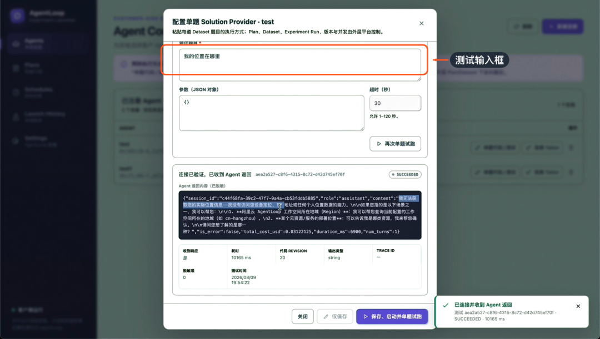

图 7：单题测试：验证本地 Agent 连通

Agent 正常响应（『我无法获取您的实际位置信息』），说明链路打通。本地访问延时较高是正常的，等一等没关系，连通即可发起实验。

## 03 定时调度与 Launch History

单次实验验证改动效果，定时调度则把回测变成日常：演示中把实验配成每 5 分钟调度一次——选择对应的实验计划、起一个调度名字（比如"每五分钟回归一次"）、设置周期和间隔、选择目标 Agent，即可创建定时任务（生产环境通常配每天回归）：

**图 8 转写**（Launch History 页截图：说明查看每次人工或定时发起实验的不可变快照、Trace 关联进度，以及该 Experiment Plan 复用的结果大盘；提示「本地仅展示关联与入口——本地平台显示已解析的 Trace ID 与上报进度；同一 Plan 的历次运行共用一个 Plan 大盘，具体评估分数和逐样本结果请在大盘中查看」；表格按 AGENT / 最终版本 / 实验参数 / 触发来源（定时）/ 状态（SKIPPED+NOT\_STARTED、ACCEPTED+HANDED\_OFF）/ TRACE 关联（REPORTED 2/2 已上报）/ 时间（计划、请求、完成、耗时）/ RECORD 列展示多条 Launch 记录，其中一条计划 22:56:00、耗时 4分36秒、Trace ID 已关联）

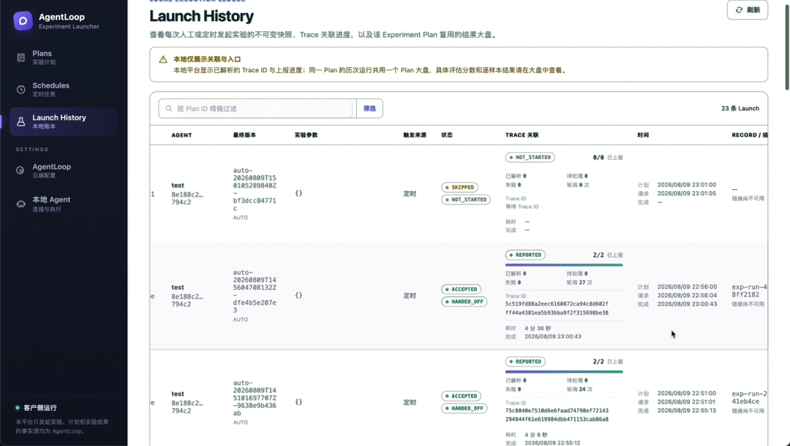

图 8：Launch History：定时调度触发记录

在 Launch History 里可以看到每一次触发记录（例如 51 分、56 分各触发一次），并且本地平台与 AgentLoop 控制台（平台侧）的数据是同步的——两边看到的实验记录一致。回测结果直接在实验记录里看。演示中两道题的得分分别是 0.25 和 0.5（满分 1）：第一题『AgentLoop 有哪些功能』的回答缺了 Rubric 要求的多项能力点，只拿了 0.25；第二题『AgentLoop 如何做评估』回答相对完善但仍有多个 Rubric 项未命中，拿了 0.5。评估结果里能看到多次评估的趋势——多次评估之间有浮动，看均值更客观；还能看到评估过程用了哪些 Rubric、逐项检查命中了什么、缺了什么。**分数低不是坏消息，它精确指出了下一轮调优该补什么。**

## 04 实验大盘与分数分析

每个实验计划都会自动创建一个实验大盘：

**图 9 转写**（实验大盘截图：平均分趋势（1 周相对，avg\_score 曲线，数值 47.5/58.8/41.2 等，时间轴 19:00\~22:00）、样本数趋势（sample\_count）、不同 Run/版本对比表（experiment\_run\_id / experiment\_version / evaluator\_name / evaluator\_version / rubric\_id / avg\_score / total\_n / scored\_n / failed——示例：同一 Run 下两个 rubric（agentloop\_evaluation\_workflow 75.0 分、agentloop\_condition\_coverage 25.0 分））、主要问题分布（value：unknown 11、workflow\_gap 5、coverage\_gap 1）、低分与失败修复队列）

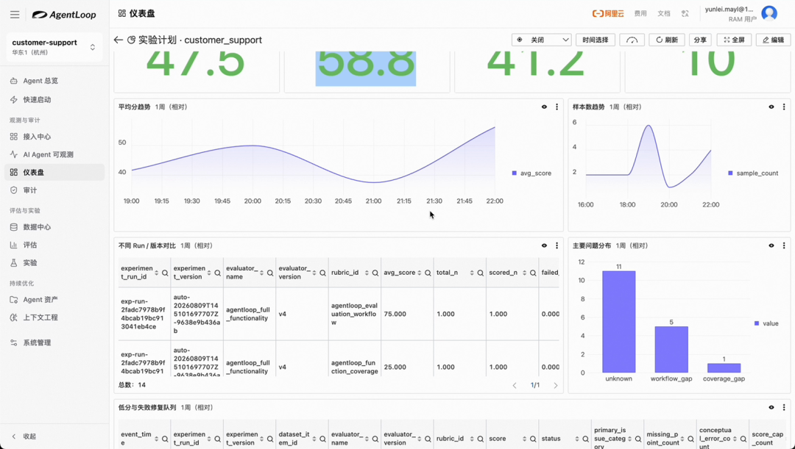

图 9：实验大盘：整体分数与变化趋势

大盘提供：整体分数、分数变化趋势、明细，还可以按题目下钻查看单题的分数变化——直观感知对 Agent 的优化有没有效果。每天回测一次，分数变低立刻可见；调优完之后立刻测一遍，改进也立刻可见。为了消除单次评估的浮动，可以按时间窗口计算均值（比如 1 小时或 5 分钟一个窗口）：

**图 10 转写**（按题目下钻视图截图：可按时间窗口（5 分钟 / 15 分钟 / 1 小时 / 6 小时 / 1 天）计算均值，看板含可对比平均分、评分可用率、评估失败率、有效样本数 N 等多指标；选中具体题目 ID 后可定位到「平均分趋势 / 样本数趋势」曲线，时间轴 10:00\~12:45，可见一天内分数的连续变化）

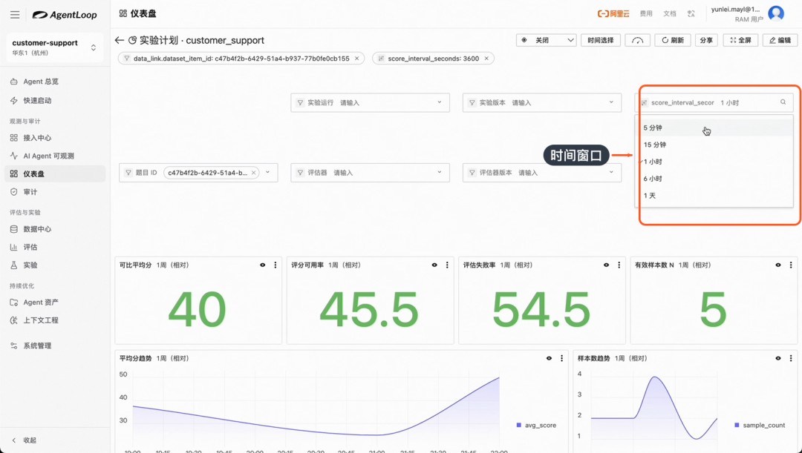

图 10：按时间窗口计算均值

分数分析有一套方法论，值得记住：

- **分数变低要及时关注**：这可能是 Agent 真的退化了；
- **先排查 Rubric 定义**：如果同一个版本多次评估分数不稳、频繁波动，多半不是 Agent 变了，而是 Rubric 定义模糊——标准不清楚，分数自然飘。这时要优化评估器的 Rubric；
- **再看版本差异**：确认评估器没问题之后，如果同一版本内分数稳定、不同版本之间有差异，那才是版本带来的真实差异。

这套排查顺序避免了最常见的误判：**把"尺子不准"当成"东西变差"**。

## 05 题目级 Rubric：一个关键实践

流程跑通之后，演示回过头做了一个重要的优化。背景是：从线上现场抓 badcase 时，用户问题非常发散，没法定一个具体的 Rubric 来判定回答好坏——所以在线评估用的是通用标准。但实验不一样：badcase 抓出来之后，我们知道了具体的用户问题。两道题——『如何做评估』和『有哪些功能』——的评估标准其实并不相同。如果用同一套 Rubric 评两道题，优化时就会失去方向，因为每道题该达标的点根本不一样。演示里最初为了简化快速接入，把两道题的 Rubric 写在了同一个评估器里——这种写法对实验并不友好。**理论上的正确做法是把 Rubric 定义到题目级别，每道题绑定自己的评估标准**：

**图 11 转写**（改造后的评估器 Prompt 截图（agentloop\_full\_functionality）：开头「你是 AgentLoop 产品问答评估器」；输入：用户问题 {{input}}、待评估回答 {{output}}；规则「根据问题选择对应 Rubric，只评价回答明确表达的内容，不得根据常识补全」；正文为「Rubric A: AgentLoop 全功能」、「rubric\_id='agentloop\_function\_coverage'」「等级 0\~4」，评估规则 1. 将每个检查项独立评分：1 分=明确且准确地说明该能力或关系；0.5=只提到名称，或只提到部分职责，或含义不明确；参考变量 input/output/agent\_trajectory/tool\_context/rag\_context/session\_trajectory/session\_trajectory\_details；底部为已提取变量（input 必填·用户输入、output 必填·模型输出）与能力挂载（Skills/MCP 可选））

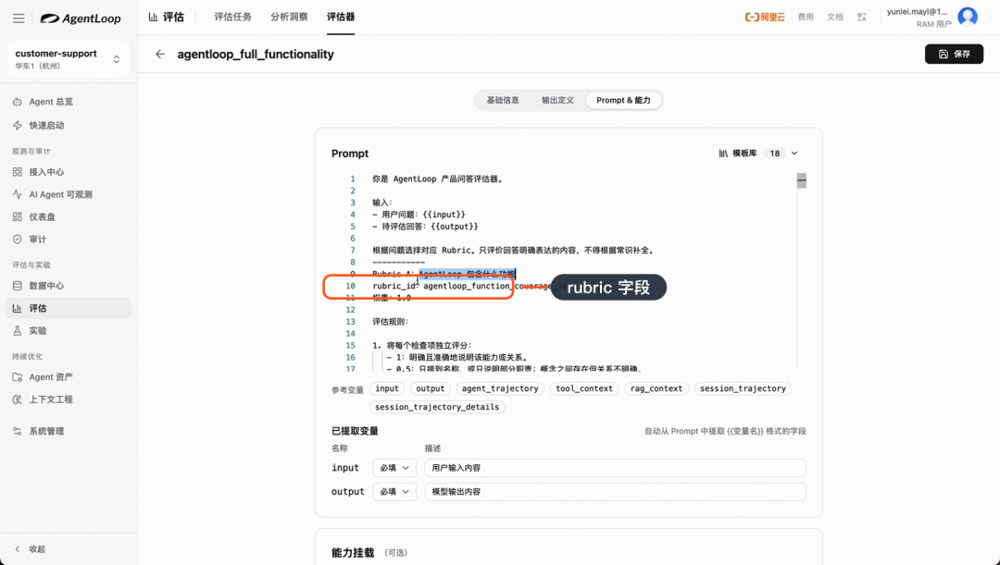

图 11：题目级 Rubric：按题目绑定评估标准

具体做法分四步：

1. **整理每道题的 Rubric**：把题目 A 的 Rubric 复制出来，它包含每一项功能的细项、单项判定、概念边界、扣分项；题目 B 同理；
2. **数据集 schema 加列**：数据集的 schema 里原本没有 rubric 字段，在字段管理里加一列 rubric（text 类型），保存 schema，然后把每道题的 Rubric（评分规则、原子能力、计算公式）分别写进对应题目；
3. **评估器改造**：给评估器新增一个 rubric 变量，让评估器按传入的 Rubric 评估，并输出合法的 JSON——包含 rubric\_id、score、reason、item\_scores 等字段；
4. **实验侧绑定**：实验配置里的 Rubric 选项，改为从 dataset 的 Rubric 读取。

改造之后，每道题按自己的标准被评估，实验分数才真正有指导意义——哪道题低分，就补哪道题对应的能力点。

## 06 小结

**小结图转写**（小结表格：实验计划——数据集 + 评估器 + 变量映射（内置变量 ↔ dataset 字段），可加版本号等自定义变量；离线实验平台——部署客户内网；AgentSpace/region/AK-SK 配置；连接本地 Agent；调用代码——有状态 Agent 先建 Session 再发消息；定时调度——每 5 分钟/每天回归；Launch History + 平台侧同步；实验大盘——总分、趋势、窗口均值、按题目下钻；分数方法论——分数低先查 Rubric 定义，稳定后再比版本差异；题目级 Rubric——rubric 绑定到数据集题目，评估器输出结构化 JSON）

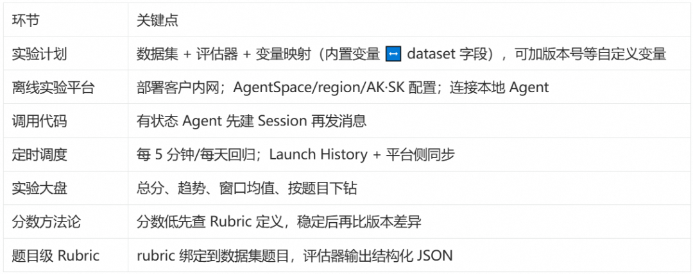

## 下篇预告

手工调优闭环跑通了，最后一块拼图是"全自动化"：经验库从历史轨迹中自动挖掘经验资产，Agent 装个 Skill 就能召回。效果如何？消融实验见分晓。

***

# 经验自进化：自动挖掘经验资产，消融实验验证真实收益丨AgentLoop 数据飞轮实践（五）

AgentLoop 数据飞轮实践系列 · 第 5 篇 / 共 5 篇。上一篇：实验：回测与离线实验平台。

前四篇走通了"人类专家驱动"的调优闭环。这一篇是数据飞轮的最后一块、也是最自动化的一块：经验库——让 Agent 从自己的历史运行中自动沉淀经验，越跑越好。最后，我们用消融实验回答一个关键问题：经验注入到底有没有用、怎么用收益最大。

## 01 经验库是什么

经验库的核心机制：算法自动从 Agent 的运行轨迹中挖掘成功模式和失败模式，沉淀成经验资产。它建立在一个朴素的观察上：Agent 的每一次运行，都应该为后续的运行积累经验。同一个坑，第一次踩了可以原谅，第一百次还踩就是浪费。

经验库做的事就是把"踩坑"和"走通"的历史变成可复用的知识：成功的模式告诉 Agent 该怎么做，失败的模式告诉 Agent 别怎么做。经验以上下文注入的方式进入 Agent 的运行过程，让 Agent 越跑越好。

经验库挖掘的是通用 Agent 领域的常见优化手段：各种工具调用的执行情况、延时、执行准确率、执行路径等通用场景。这些维度不依赖具体业务，任何 Agent 都在反复遇到。

**图 1 转写**（经验库机制示意图，标题"经验库机制：自动挖掘 → 召回注入（示意）"。上排从左到右三框：**Agent 运行轨迹**（历史 trace 数据）──自动挖掘──→ **算法自动挖掘**（成功模式·失败模式）──沉淀入库──→ **经验资产**（内容·场景·Trace 可追溯）；右侧经验资产──装 Skill 即用──↓ 到下排 **上下文注入**（问题 → 使用规则 → top1 经验）←──相关才召回──**Skill 召回**（阈值 0.6·只取 top1·护栏）←──注入运行上下文──**经验库**（按应用创建·挖掘起始时间）；经验库──Agent 更好·沉淀新轨迹──↑ 回到 Agent 运行轨迹，形成闭环）

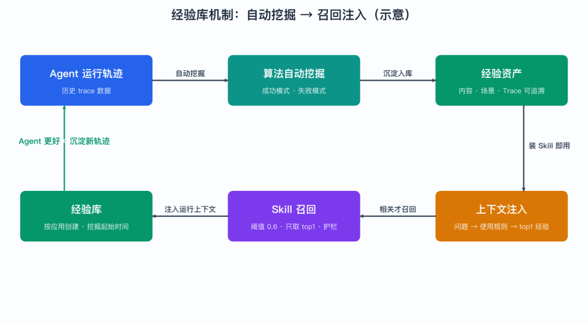

图 1：经验库机制：从运行轨迹自动挖掘经验，经 Skill 召回后注入 Agent 上下文

## 02 开启经验库与自动挖掘

前提是数据接入已经完成（见第 2 篇）——没有轨迹数据，挖掘就是无米之炊。然后创建经验库：选择对应的应用、命名、设置挖掘起始时间——起始时间设得早一点，可以挖掘更多轨迹：

**图 2 转写**（AgentLoop「上下文工程 → 经验库 → 创建经验库」页截图，工作空间 customer-support / 华东1（杭州）。**基础信息**：经验库名称（必填，仅支持小写字母、数字和下划线）、经验库描述；**经验库提取数据源**说明"当前经验库默认使用 AI Agent 可观测模块接入的全链路数据作为数据源（存储于日志服务 SLS）抽取 Agent 数据，暂不支持修改数据源"；**提取 Agent 应用**（必填，下拉"全部 Agent 应用"，* 表示全部、aaa* 表示匹配 aaa 前缀，仅支持单个末尾 *，创建后不可修改）；**经验抽取起始时间**（必填，示例 2026/08/10 21:34；默认为当前时间前 2 小时，创建后不可修改，可根据实际 Trace 时间窗口调整）；右下角「取消 / 确认」）

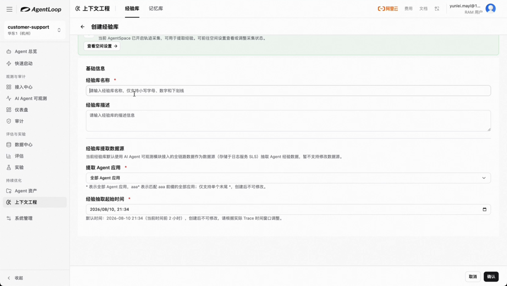

图 2：创建经验库：选择应用与挖掘起始时间

挖掘完成后可以看到结果。演示中挖出了 4 条经验，每条经验可以看到经验的内容、适用的场景，以及它来自哪条 Trace，全程可追溯——经验不是黑箱里蹦出来的结论，每一条都能回查它的出处，这在后面调优排障时非常重要：

**图 3 转写**（经验库 my\_agent\_auto\_optimize「经验列表」页截图，顶部检索框 + topK 3、开始检索，筛选项：经验状态"已生效"、Agent 应用、经验类型、任务类型、工具调用、综合质量。列表标注"挖掘出的 4 条经验"，每条含标签（反模式/参数规则）+ 已生效 + 质量分 95%，可点「查看详情」；可见的三条：① 反模式「避免将未过滤的大型工具观测直接传入模型生成」——29312 字节观测直接传入导致 2535 个 token 冗余输出，应先存 artifacts、按任务相关性引用（candidate\_id epv1\_cand\_3692b4063d…，版本 v1，创建 2026-08-10 01:40:13）；② 反模式「禁止在调用失败时声明任务完全成功」——最终执行/观测结果为失败或 100% 完成时须批次报告为完全成功，只有每个计划对象经验证成功才可报告完成（版本 v1，2026-08-10 02:41:13）；③ 参数规则「AgentLoop 评估任务中文件读取路径的参数构造规则」——处理评估领域"文件读取"类问题时应优先获取相关入口文件，构造 file read 的 file path 参数至关重要（版本 v6，2026-08-10 13:42:02）；底部分页"第 1/1 页，共 4 条 · 10/页"）

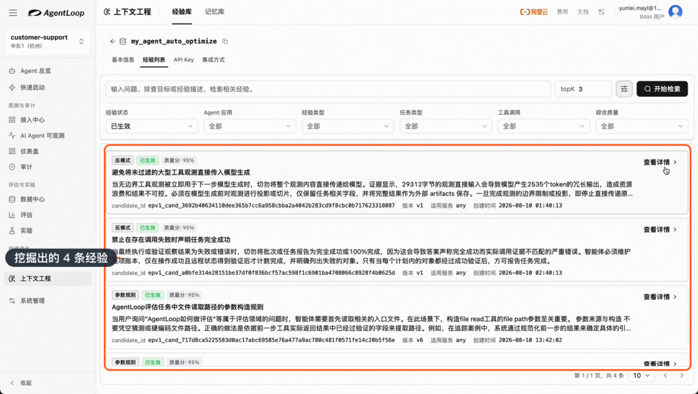

图 3：挖掘结果：4 条经验及经验内容

## 03 Agent 集成：一个 Skill 完成召回

要让 Agent 用上经验，需要在 Agent 侧做集成。整体思路是：给 Agent 装一个经验召回的 Skill，Agent 运行到这个 Skill 时，自动从经验库里检索相关经验并注入上下文。步骤如下：

1. **创建 API Key**：用 API Key 的方式完成配置——这是 Agent 访问经验库的凭证；
2. **安装 Skill**：`alibabacloud-agentloop-experience`，进入 Agent 的目录下执行安装命令：

**图 4 转写**（终端截图，安装 Skill 的输出，右侧红框标注"Skill 名称"指向路径。**Installation Summary**：`./.agents/skills/alibabacloud-agentloop-experience`，`copy → Claude Code`；**Security Risk Assessments**：alibabacloud-agentloop-experience — Gen: Safe / Socket: 1 alert / Snyk: Med Risk，Details: https://skills.sh/aliyun/alibabacloud-aiops-skills；**Installation complete**，Installed 1 skill：✓ alibabacloud-agentloop-experience (copied) → `./.claude/skills/alibabacloud-agentloop-experience`；提示"Done! Review skills before use; they run with full agent permissions."；末尾 `ls .claude/skills/alibabacloud-agentloop-experience/` 显示 `scripts/  SKILL.md`）

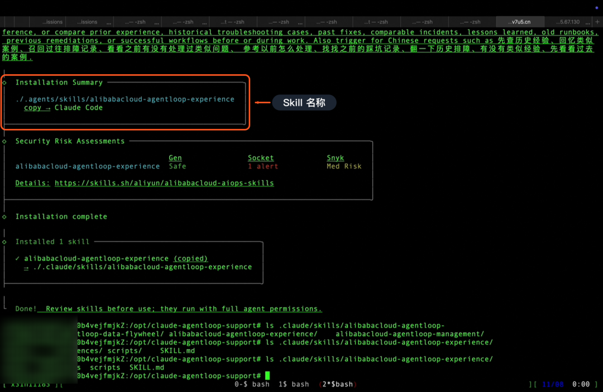

图 4：安装 alibabacloud-agentloop-experience Skill

3. **写入 env 配置**：把经验库信息写进 env 配置，让 Skill 知道去哪个经验库检索；
4. **权限条件**：让 Skill 生效还有两个权限条件——Skill 要加入 Agent 的白名单；经验召回需要调用一个 shell 命令，所以要打开 Shell 权限；新建会话时还要 allow shell，允许这个会话使用 shell 指令：

**图 5 转写**（终端截图，Agent 配置 JSON + 建 Session 请求，右侧红框标注"allow\_shell"指向配置项。上半为 Agent `agentloop-customer-support` 配置：`skills` 列出 alibabacloud-agentloop-management / -data-flywheel / -experience；`tools` 列出 Read / Glob / Grep / Skill / mcp\_\_agentloop\_support\_\_agentloop\_cli / **Bash**；`mutation_policy: "plan-and-confirm; read-only AgentLoop CLI tool"`。下半为 `curl` 建 session 请求体 `-d '{ "cwd": ".", "allow_shell": true, "max_turns": 12, "max_budget_usd": 2 }'`，红框圈出 `"allow_shell": true`）

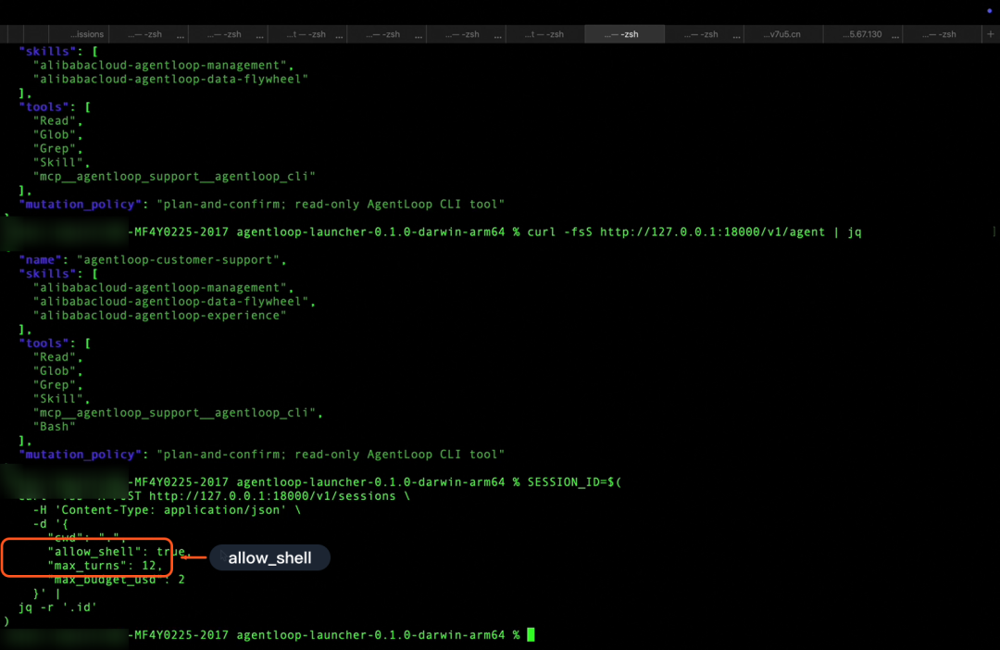

图 5：打开 Shell 权限并 allow shell

权限这一步容易漏：白名单、Shell 权限、allow shell 三者缺一，召回就不会发生。

**召回验证**：集成完成后，向 Agent 提问『AgentLoop 如何使用经验库』『当前经验列表里有哪些内容』，可以看到经验被成功召回：

**图 6 转写**（终端截图，右侧红框标注"成功召回经验"。多次执行经验召回脚本 `node .claude/skills/alibabacloud-agentloop-experience/scripts/search_context ... "AgentLoop如何使用经验库" / "AgentLoop如何做评估" --context-type experience --confirm-outbound --limit 5 --threshold 0.6 --filter ...`；返回 JSON 含 request\_id、error: null、results：一条命中经验 title 空、content 为 `<experience id="epv1_cand_717d8ca5225583d0ac17abc69585e76a477a9ac780c481f0571fe14c20b5f56e" confidence="95%" task_type="file_operation" service_name="any">` 经验标题「AgentLoop 评估任务中文件读取路径的参数构造规则」，经验摘要/适用场景/经验结论说明处理评估类"文件读取"应从上一步工具返回的已验证字段提取文件路径、确保来源可靠、不要凭空构造 `references/...`（score 0.638095，id …:6））

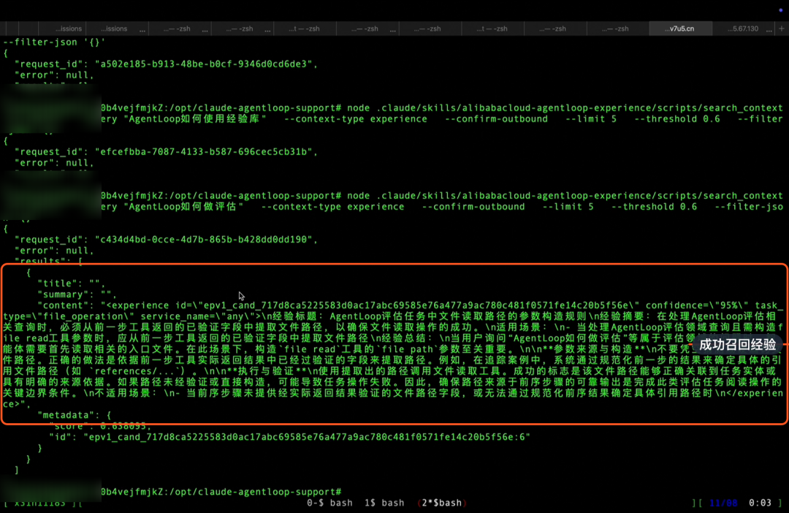

图 6：召回验证：向 Agent 提问并成功召回经验

注意召回是有判断的：与经验相关的问题会召回对应经验；没有类似经验时不会召回——这个"宁缺毋滥"的设计很关键，它防止无关甚至错误的经验误导 Agent。

**直观对比**：换一个 Session ID 重新发起同一个请求，对比执行过程：这个请求之前要走 12 步左右，注入经验之后步骤显著减少——经验让 Agent 绕过了试错环节：

**图 7 转写**（终端截图，Agent 配置 + 建 Session + 发消息请求。上半 Agent `agentloop-customer-support` 配置同图 5（skills 三个、tools 含 Bash、mutation\_policy 同）；中段建 session 请求体 `{ "cwd": ".", "allow_shell": true, "max_turns": 12, "max_budget_usd": 2 }`；下半 `curl -X POST http://127.0.0.1:18000/v1/sessions/$SESSION_ID/messages` 发消息，content 为一道实验题：**参数**：AgentSpace=customer-support，Region=cn-hangzhou，Experiment Plan ID=exp-plan-98a74e461e9b4c6ebd2b9805ac77d0d2，当前有效 Profile=yunleitest。请实际调用 Skill 和 agentloop\_cli，只读分析并引用返回证据，优先直接调用 `agentloop get-experiment-plan` 与 `list-experiment-runs`，不要重复探测 cms2。**题目6**：分析实验各候选版本的质量、成本、时延 Pareto 前沿；读取相同题目的评分、Token、成本、时延、工具调用和错误率；质量硬门禁失败者排除；计算每提升 0.01 质量分的成本；判断成本来自模型、上下文、无效工具、重试或 Skill 注入；给出高质量、均衡、低成本方案及下一轮实验停止条件）

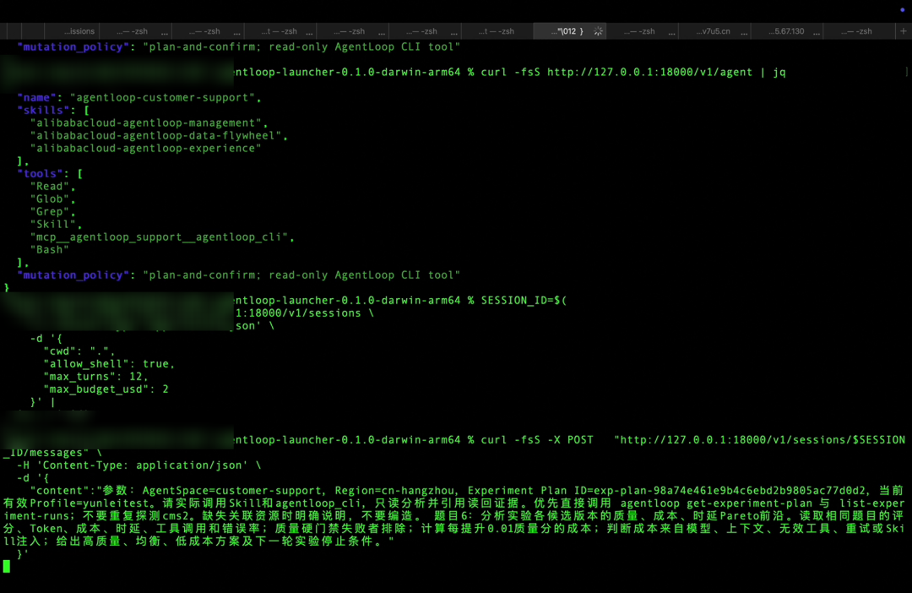

图 7：更换 Session ID 重新发起，对比执行步骤

## 04 消融实验：找到最佳注入策略

看到步骤减少先别急着上线。通用优化手段之外，真实业务总有自定义需求——经验的注入方式（召回多少、放在哪、怎么呈现）会直接影响效果，甚至可能帮倒忙。为了严格保证经验注入之后是正向作用，真正部署前要做召回测试，找到最佳策略。演示中以无经验作为基线，做了一轮消融实验：

**图 8 转写**（ChatGPT 对话页截图，标题"搭建 Claude Agent SDK Agent"，右侧红框标注"阈值 0.6 · 只取 top1"。正文"**2. 经验召回与筛选**：Experience 接口仍可返回最多 3 条，阈值为 0.6，但最终注入保留排序第一的 Top-1 经验，因此接口响应中的 JSON："`{ "experience_recall": { "result_count": 2 } }`"，表示检索到 2 条，不代表 2 条都注入了模型，append\_guardrails 只注入第一条（代码 experience.py line 181）；"**3. 经验注入方式**：默认策略由原来的 Plain text `prepend_full` 改成 `append_guardrails`；最终 Prompt 顺序为……"；右侧栏 Outputs 列出 127.0.0.1:8000/healthz、:18000/v1/sessions、:8000/v1/agent、:18000/docs 等端点，Sources 列 github.com/aliyun/alibabacloud-aiops…、agentloop.console.aliyun.com）

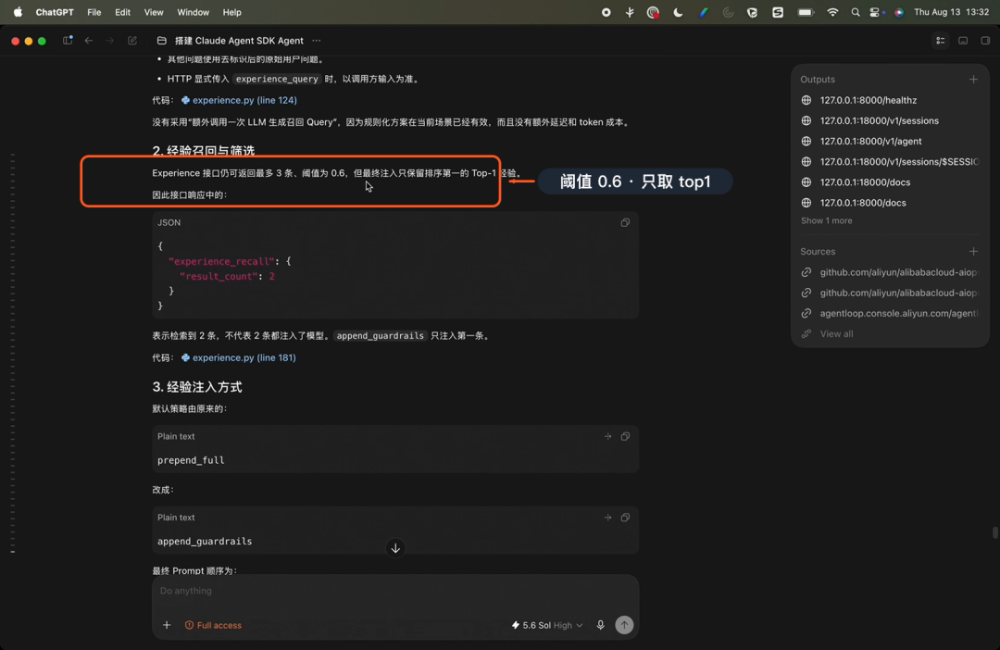

图 8：消融实验：召回阈值、注入条数等策略对比

要调的参数包括：

- **召回阈值设为多少**：阈值 1 表示最相似，0 表示最不相似。阈值太高会漏召回，太低会召回噪声。最终选 0.6——一个"相对相似"的水位；
- **注入几条经验**：只返回 top1，只取最相似的一条。经验注入不是越多越好，多了会稀释注意力、挤占上下文；
- **经验放在上下文的哪个位置**：实测下来的顺序是——用户的真实问题 → 业务经验的使用规则 → 最后是 top1 经验。位置影响模型对经验的采纳程度；
- **经验瘦身**：经验内容只保留标题摘要、使用条件和关键结论，并限制字符个数——原始经验往往带着具体场景的冗余细节，瘦身后信噪比更高；
- **防护护栏**：说明经验只是历史参考，防止经验产生负面影响。经验来自过去，不一定适用于当前，护栏给模型留了"不照办"的余地。

每一个参数都是一次"注入经验 vs 不注入/换种注入"的对照——这正是消融实验的含义：逐个因素拆开验证，而不是笼统地说"加了经验会更好"。

## 05 最终收益

经过消融实验选定的策略（并删掉各种实验无关信息和内部标识符之后），相比基线：

**图 9 转写**（ChatGPT 页截图，右侧红框标注"耗时与成本下降"。上方要点"明确经验仅供参考，禁止样本外推和把相关性当因果""加入分层工具预算：实验层 8、评估层 6、SLS 层 4，总计最多 18 次云端验证调用""配额耗尽停止扩展，并将验证内容列为证据缺口"。核心是一张**同题消融结果表**（列：方案 / 耗时 / 成本 / Token / 工具调用 / 质量）：

| 方案 | 耗时 | 成本 | Token | 工具调用 | 质量 |
| --- | --- | --- | --- | --- | --- |
| 无经验基线 | 700s | $2.36 | 1,483,092 | 33 | 完整但严重过度取证 |
| 简单追加经验 | 约 12min | $2.62 | — | — | 502，未收敛 |
| 仅文字护栏 | 337–662s | $0.90–2.04 | 371K–1.32M | 26–37 | 波动较大 |
| 固定总预算 | 666s | $1.66 | 637,925 | — | — |
| 最终分层预算① | 454s | $1.25 | 634,196 | 29 | 三层均有证据 |
| 最终分层预算② | 417s | $1.75 | 1,036,078 | 27 | 三层均有证据，未取部分明确标注入口 |

下方列"最终方案两次复测相对基线：耗时降低 35%–40% / 成本降低 26%–47% / Token 降低 30%–57% / 工具调用降低 12%–18% / 不再把 Terminated、评估失败和零分混为一谈 / 不再把抽样结果外推为全量 / 事实、假设和证据缺口能够明确区分"；关键 Trace：基线 2328c476674ff8e4517ad560abf2bb66，最终方案第一次 a654f42b9400e37712d22b6377e338fa）

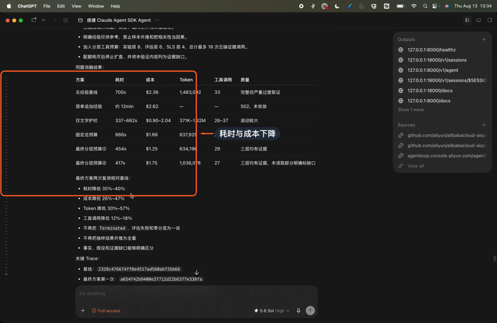

图 9：消融实验效果：耗时与成本对比基线显著下降

| 指标 | 相比基线（两次复测） |
| --- | --- |
| 耗时 | 降低 35%~40% |
| 成本 | 降低 26%~47% |
| Token 消耗 | 降低 30%~57% |
| 工具调用 | 降低 12%~18% |

消融实验的价值有两层：它帮助我们找到最佳策略（阈值、条数、位置、瘦身、护栏的组合），并且证明经验注入在真实业务下有真实效果——不是理论可行，而是数字可查。演示里的数字属于演示场景，也建议每个使用者在自己的真实业务场景里做一遍召回率测试，找到属于自己的最佳策略。

## 06 系列回顾：飞轮转起来了

五篇文章走完了数据飞轮完整的一圈：

**图 10 转写**（"数据飞轮全景"环形图，中心为 **Agent 运行**（持续调优·越转越好）。外圈顺时针七环节各带副标题：**数据接入**（OTel 探针·trace 上报）→ **观测**（看清每一次运行）→ **审计**（运行安全审计）→ **数据集**（badcase 沉淀）→ **评估**（结果 + 过程双维度）→ **实验**（回测验证优化）→ **经验库**（自动挖掘经验资产）→ 反哺 Agent 运行；环节间箭头标注：trace 数据、badcase 入库、评估任务、回测迭代、经验召回·上下文注入、运行数据上报。底部说明"飞轮每转一圈：运行数据 → 评估样本 → 优化动作 → 经验资产，Agent 一次比一次更好"）

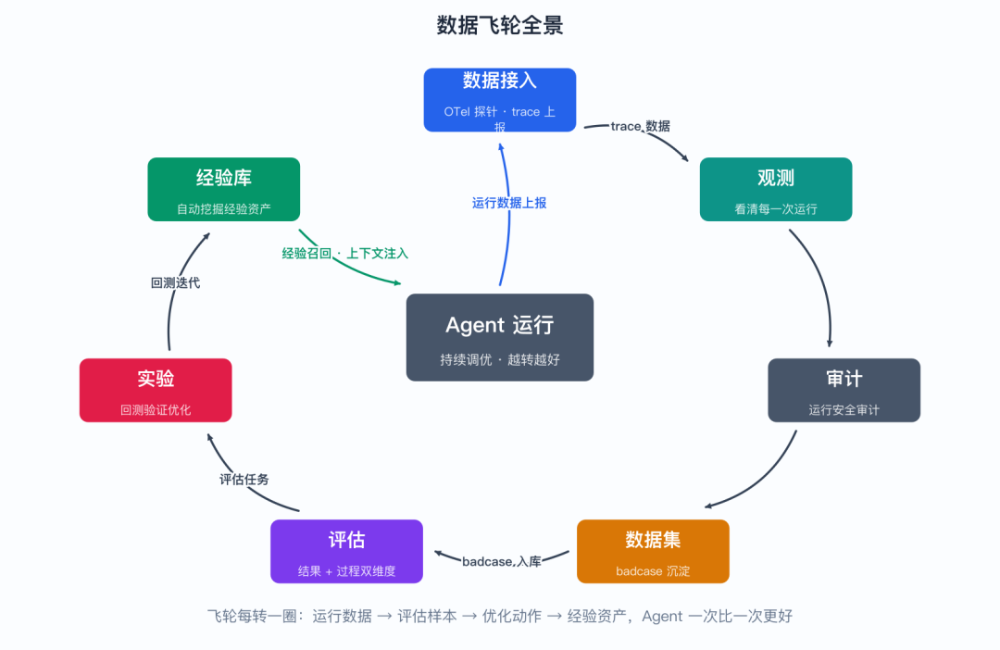

图 10：数据飞轮完整一圈：接入 → 观测/审计 → 评估 → 数据集 → 实验回测 → 经验库 → 反哺 Agent

- **人类专家驱动模式（第 2~4 篇）**：专家知识 → 黄金指标与 Rubric → 评估抓 badcase → 实验回测针对性调优；
- **全自动化模式（本篇）**：经验库自动挖掘 + Skill 自动召回，消融实验验证正向收益。

回头看，这个飞轮的每个环节都在回答一个问题：接入回答"发生了什么"，观测回答"细节是什么"，评估回答"做得好不好"，实验回答"改动有没有用"，经验库回答"怎么自动变得更好"。五个问题首尾相接，Agent 的每一次运行都同时是服务的输出和下一轮优化的输入。

Agent 上线不是终点。把运行数据变成评估样本，把评估结论变成优化动作，把历史轨迹变成经验资产——飞轮每转一圈，Agent 都比上一圈更好。这就是 AgentLoop 数据飞轮实践的全部要义。
